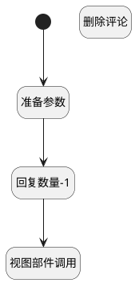

## 回复下删除评论 <!-- {docsify-ignore-all} -->

   回复下删除评论

### 处理过程




### 处理步骤说明

#### 开始 :id=Begin<sup class="footnote-symbol"> <font color=gray size=1>[开始]</font></sup>


#### 准备参数 :id=PREPAREJSPARAM1<sup class="footnote-symbol"> <font color=gray size=1>[准备参数]</font></sup>


1. 将`Default(传入变量).id` 设置给  `commnet(评论).id`
2. 将`ctx(上下文变量).discuss_post` 设置给  `commnet(评论).post_id`
3. 将`ctrl(当前部件对象).panelItems.comments.editor` 设置给  `comments_controller(评论部件控制器)`
4. 将`Default(传入变量).id` 设置给  `comment_key(评论标识)`

#### 回复数量-1 :id=RAWJSCODE1<sup class="footnote-symbol"> <font color=gray size=1>[直接前台代码]</font></sup>


<p class="panel-title"><b>执行代码</b></p>

```javascript

var comments_count = uiLogic.ctrl.panelItems.comment_count;
if (comments_count.value == 1) {
    uiLogic.ctrl.panelItems.comments.state.visible = false;
    comments_count.value = 0;
    comments_count.state.visible = false;
} else {
    comments_count.value = comments_count.value - 1;
}
```

#### 视图部件调用 :id=VIEWCTRLINVOKE1<sup class="footnote-symbol"> <font color=gray size=1>[视图部件调用]</font></sup>


调用`comments_controller(评论部件控制器)`的方法`deleteItem`，参数为`comment_key(评论标识)`
#### 删除评论 :id=DEACTION1<sup class="footnote-symbol"> <font color=gray size=1>[实体行为]</font></sup>


调用实体 [讨论回复(DISCUSS_REPLY)](module/Team/discuss_reply.md) 行为 [删除评论(del_comment)](module/Team/discuss_reply#行为) ，行为参数为`commnet(评论)`


### 实体逻辑参数

|    中文名   |    代码名    |  数据类型      |备注 |
| --------| --------| --------  | --------   |
|评论部件控制器|comments_controller|部件对象||
|上下文变量|ctx|导航视图参数绑定参数||
|评论|commnet|数据对象||
|评论标识|comment_key|简单数据||
|当前部件对象|ctrl|当前部件对象||
|传入变量(<i class="fa fa-check"/></i>)|Default|数据对象||
