## 回复下发送评论 <!-- {docsify-ignore-all} -->

   回复下发送评论

### 处理过程

```plantuml
@startuml
hide footbox
<style>
root {
  HyperlinkColor #42b983
}
</style>

hide empty description
state "开始" as Begin <<start>> [[$./reply_send_comment#begin {开始}]]
state "填充评论属性" as PREPAREJSPARAM1  [[$./reply_send_comment#preparejsparam1 {填充评论属性}]]
state "保存评论" as DEACTION1  [[$./reply_send_comment#deaction1 {保存评论}]]
state "视图部件调用" as VIEWCTRLINVOKE1  [[$./reply_send_comment#viewctrlinvoke1 {视图部件调用}]]


Begin --> PREPAREJSPARAM1 : [[$./reply_send_comment#begin-preparejsparam1{评论内容不为空} 评论内容不为空]]
PREPAREJSPARAM1 --> DEACTION1
DEACTION1 --> VIEWCTRLINVOKE1


@enduml
```




### 处理步骤说明

#### 开始 :id=Begin<sup class="footnote-symbol"> <font color=gray size=1>[开始]</font></sup>


#### 填充评论属性 :id=PREPAREJSPARAM1<sup class="footnote-symbol"> <font color=gray size=1>[准备参数]</font></sup>


1. 将`Default(传入变量).pid` 设置给  `comment(评论对象).principal_id`
2. 将`ctrl(控制器).panelItems.comments.editor` 设置给  `comment_controller(评论部件控制器)`
3. 将`Default(传入变量).pid` 设置给  `ctx(上下文变量).discuss_reply`
4. 将`Default(传入变量).value` 设置给  `comment(评论对象).content`

#### 保存评论 :id=DEACTION1<sup class="footnote-symbol"> <font color=gray size=1>[实体行为]</font></sup>


调用实体 [讨论回复(DISCUSS_REPLY)](module/Team/discuss_reply.md) 行为 [发送评论(send_comment)](module/Team/discuss_reply#行为) ，行为参数为`comment(评论对象)`

将执行结果返回给参数`comment(评论对象)`

#### 视图部件调用 :id=VIEWCTRLINVOKE1<sup class="footnote-symbol"> <font color=gray size=1>[视图部件调用]</font></sup>


调用`comment_controller(评论部件控制器)`的方法`addItem`，参数为`comment(评论对象)`
### 连接条件说明
#### 评论内容不为空 :id=Begin-PREPAREJSPARAM1

```Default(传入变量).value``` ISNOTNULL AND ```Default(传入变量).pid``` ISNOTNULL


### 实体逻辑参数

|    中文名   |    代码名    |  数据类型      |备注 |
| --------| --------| --------  | --------   |
|控制器|ctrl|当前部件对象||
|传入变量(<i class="fa fa-check"/></i>)|Default|数据对象||
|上下文变量|ctx|导航视图参数绑定参数||
|评论对象|comment|数据对象||
|评论部件控制器|comment_controller|部件对象||
