## 测试库编号(LIBRARY_IDENTIFIER) <!-- {docsify-ignore-all} -->

   

### 默认规则 :id=Default

```plantuml
@startuml
hide empty description
<style>
root {
  HyperlinkColor #42b983
}
</style>

state "start" as start  <<start>>
state "end" as end <<end>>
state "默认字符串长度" as 422c5d2be9dd04260ac1b3b2285088bb [[$./Library_identifier#a422c5d2be9dd04260ac1b3b2285088bb {"默认字符串长度"}]]


start --> 422c5d2be9dd04260ac1b3b2285088bb 
422c5d2be9dd04260ac1b3b2285088bb --> end 


@enduml
```

#### 条件说明

##### 默认字符串长度 :id=a422c5d2be9dd04260ac1b3b2285088bb

*关键条件*

`LIBRARY_IDENTIFIER(测试库编号)` 属性长度在区间 `(0 , 15]` 内

> [!ATTENTION|label:规则信息|icon:fa fa-warning]
> 内容长度必须小于等于[15]

