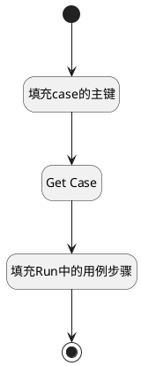

## 附加用例步骤 <!-- {docsify-ignore-all} -->

   

### 处理过程

### 处理步骤说明

#### 开始 :id=Begin [开始]

*- N/A*
#### 填充case的主键 :id=PREPAREPARAM1 [准备参数]

1. 将`Default(传入变量).CASE_ID(测试用例标识)` 设置给  `test_case_obj(用例对象).ID(标识)`

#### Get Case :id=DEACTION1 [实体行为]

调用实体 [用例(TEST_CASE)](module/TestMgmt/Test_case.md) 行为 [Get](module/TestMgmt/Test_case#行为) ，行为参数为`test_case_obj(用例对象)`

将执行结果返回给参数`test_case_obj(用例对象)`

#### 填充Run中的用例步骤 :id=PREPAREPARAM2 [准备参数]

1. 将`test_case_obj(用例对象).STEPS(步骤)` 设置给  `Default(传入变量).STEPS(步骤)`

#### 结束 :id=END1 [结束]

返回 `Default(传入变量)`

### 实体逻辑参数

|    中文名   |    代码名    |  数据类型    |  实体   |备注 |
| --------| --------| -------- | -------- | --------   |
|传入变量(<i class="fa fa-check"/></i>)|Default|数据对象|[执行用例(RUN)](module/TestMgmt/Run.md)||
|用例对象|test_case_obj|数据对象|[用例(TEST_CASE)](module/TestMgmt/Test_case.md)||
