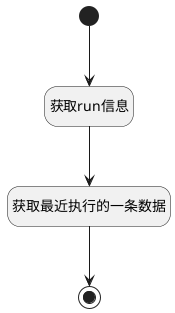

## 获取当前用例详情 <!-- {docsify-ignore-all} -->

   

### 处理过程




### 处理步骤说明

#### 开始 :id=Begin<sup class="footnote-symbol"> <font color=gray size=1>[开始]</font></sup>


*- N/A*
#### 获取run信息 :id=DEACTION1<sup class="footnote-symbol"> <font color=gray size=1>[实体行为]</font></sup>


调用实体 [执行用例(RUN)](module/TestMgmt/Run.md) 行为 [Get](module/TestMgmt/Run#行为) ，行为参数为`Default(传入变量)`

将执行结果返回给参数`Default(传入变量)`

#### 获取最近执行的一条数据 :id=RAWSQLCALL1<sup class="footnote-symbol"> <font color=gray size=1>[直接SQL调用]</font></sup>


<p class="panel-title"><b>执行sql语句</b></p>

```sql
-- 最近执行	
SELECT
	t2.NAME AS RECENT_TEST_PLAN,
	t.EXECUTOR_NAME AS RECENT_EXECUTOR_NAME,
	t.EXECUTED_AT AS RECENT_EXECUTED_AT,
	t.`STATUS` AS RECENT_RUN_HISTORY
FROM
	run t,
	test_plan t2
WHERE
	t.CASE_ID = ?
	AND t.`STATUS` IS NOT NULL 
	AND t.PLAN_ID = t2.id 
ORDER BY
	EXECUTED_AT DESC 
	LIMIT 1
```

<p class="panel-title"><b>执行sql参数</b></p>

1. `Default(传入变量).CASE_ID(测试用例标识)`

重置参数`Default(传入变量)`，并将执行sql结果赋值给参数`Default(传入变量)`

#### 结束 :id=END1<sup class="footnote-symbol"> <font color=gray size=1>[结束]</font></sup>


返回 `Default(传入变量)`


### 实体逻辑参数

|    中文名   |    代码名    |  数据类型    |  实体   |备注 |
| --------| --------| -------- | -------- | --------   |
|传入变量(<i class="fa fa-check"/></i>)|Default|数据对象|[执行用例(RUN)](module/TestMgmt/Run.md)||
