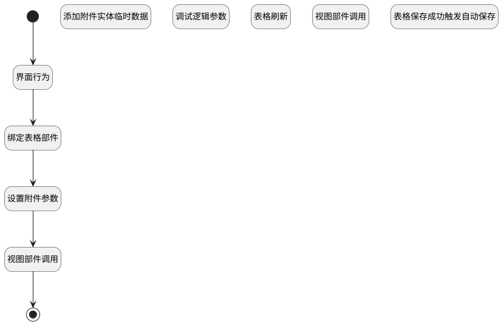

## 添加附件数据 <!-- {docsify-ignore-all} -->

   

### 处理过程




### 处理步骤说明

#### 开始 :id=Begin


#### 添加附件实体临时数据 :id=RAWJSCODE2


<p class="panel-title"><b>执行代码</b></p>

```javascript
ibiz.hub.getApp(context.srfappid).deService.exec(
    'plmweb.attachment',
    'create',
    context,
    uiLogic.attach[0],
);
```

#### 结束 :id=END1


#### 调试逻辑参数 :id=DEBUGPARAM1


> [!NOTE|label:调试信息|icon:fa fa-bug]
> 调试输出参数`当前视图对象`的详细信息

#### 界面行为 :id=DEUIACTION1


调用实体 [执行用例(RUN)](module/TestMgmt/Run.md) 界面行为 [上传附件](module/TestMgmt/Run#界面行为) ，行为参数为`files(上传文件)`

#### 绑定表格部件 :id=PREPAREJSPARAM1


1. 将`form(主表单对象).details.attachments.mdController` 设置给  `grid(重复器表格)`

#### 表格刷新 :id=VIEWCTRLINVOKE1


调用`grid(重复器表格)`的方法`refresh`，参数为`attach(附件)`
#### 视图部件调用 :id=VIEWCTRLINVOKE2


调用`form(主表单对象)`的方法`save`，参数为`Default(传入变量)`
#### 设置附件参数 :id=RAWJSCODE4


<p class="panel-title"><b>执行代码</b></p>

```javascript
// 计算新建默认值
const defaultData = uiLogic.grid.calcDefaultValue({}, true);
uiLogic.attach = uiLogic.files.map(item => 
    {
        return {
            name: item.name,
            file_id: item.id,
            id: item.uuid,
            ...defaultData,
        }
    }
)
```

#### 表格保存成功触发自动保存 :id=VIEWCTRLFIREEVENT1


触发`grid(重复器表格)`的事件`onSaveSuccess`，参数为`attach(附件)`
#### 视图部件调用 :id=VIEWCTRLINVOKE3


调用`grid(重复器表格)`的方法`addAttachMent`，参数为`attach(附件)`


### 实体逻辑参数

|    中文名   |    代码名    |  数据类型      |备注 |
| --------| --------| --------  | --------   |
|重复器表格|grid|部件对象||
|当前视图对象|view|当前视图对象||
|传入变量(<i class="fa fa-check"/></i>)|Default|数据对象||
|主表单对象|form|部件对象||
|上传文件|files|数据对象列表||
|附件|attach|数据对象列表||
