## 触发计数器刷新(run) <!-- {docsify-ignore-all} -->

   

### 处理过程

```plantuml
@startuml
hide footbox
<style>
root {
  HyperlinkColor #42b983
}
</style>

hide empty description
state "开始" as Begin <<start>> [[$./refresh_counter_run#begin {开始}]]
state "结束" as END1 <<end>> [[$./refresh_counter_run#end1 {结束}]]
state "注入脚本代码" as RAWJSCODE1  [[$./refresh_counter_run#rawjscode1 {注入脚本代码}]]


Begin --> RAWJSCODE1
RAWJSCODE1 --> END1


@enduml
```




### 处理步骤说明

#### 开始 :id=Begin


#### 结束 :id=END1


#### 注入脚本代码 :id=RAWJSCODE1


<p class="panel-title"><b>执行代码</b></p>

```javascript
ibiz.mc.command.update.send({ srfdecodename:'run'})
```


### 实体逻辑参数

|    中文名   |    代码名    |  数据类型      |备注 |
| --------| --------| --------  | --------   |
|传入变量(<i class="fa fa-check"/></i>)|Default|数据对象||
