## 刷新用例表格 <!-- {docsify-ignore-all} -->

   

### 处理过程

```plantuml
@startuml
hide footbox
<style>
root {
  HyperlinkColor #42b983
}
</style>

hide empty description
state "开始" as Begin <<start>> [[$./refresh_run_grid#begin {开始}]]
state "view" as DEBUGPARAM2  [[$./refresh_run_grid#debugparam2 {view}]]
state "刷新视图" as RAWJSCODE1  [[$./refresh_run_grid#rawjscode1 {刷新视图}]]


Begin --> DEBUGPARAM2
DEBUGPARAM2 --> RAWJSCODE1


@enduml
```




### 处理步骤说明

#### 开始 :id=Begin


#### view :id=DEBUGPARAM2


> [!NOTE|label:调试信息|icon:fa fa-bug]
> 调试输出参数`当前工具栏`的详细信息

#### 刷新视图 :id=RAWJSCODE1


<p class="panel-title"><b>执行代码</b></p>

```javascript
ibiz.mc.command.change.sendCommand({
    srfdecodename:'Run'
},"OBJECTUPDATED")

ibiz.mc.command.update.send({ srfdecodename: 'run'})
```


### 实体逻辑参数

|    中文名   |    代码名    |  数据类型      |备注 |
| --------| --------| --------  | --------   |
|当前工具栏|view|当前视图对象||
|传入变量(<i class="fa fa-check"/></i>)|Default|数据对象||
|环境变量|hjbl|||
|APP|APP|应用程序变量||
|当前表格|grid|部件对象||
