## 前置条件(PRECONDITION) <!-- {docsify-ignore-all} -->

   

### 默认规则 :id=Default

```plantuml
@startuml
hide empty description
<style>
root {
  HyperlinkColor #42b983
}
</style>

state "start" as start  <<start>>
state "end" as end <<end>>
state "默认字符串长度" as 73f5b8c04e6d07d745ffdd4e08dd80a4 [[$./Precondition#a73f5b8c04e6d07d745ffdd4e08dd80a4 {"默认字符串长度"}]]


start --> 73f5b8c04e6d07d745ffdd4e08dd80a4 
73f5b8c04e6d07d745ffdd4e08dd80a4 --> end 


@enduml
```

#### 条件说明

##### 默认字符串长度 :id=a73f5b8c04e6d07d745ffdd4e08dd80a4

*关键条件*

`PRECONDITION(前置条件)` 属性长度在区间 `(0 , 2000]` 内

> [!ATTENTION|label:规则信息|icon:fa fa-warning]
> 内容长度必须小于等于[2000]

