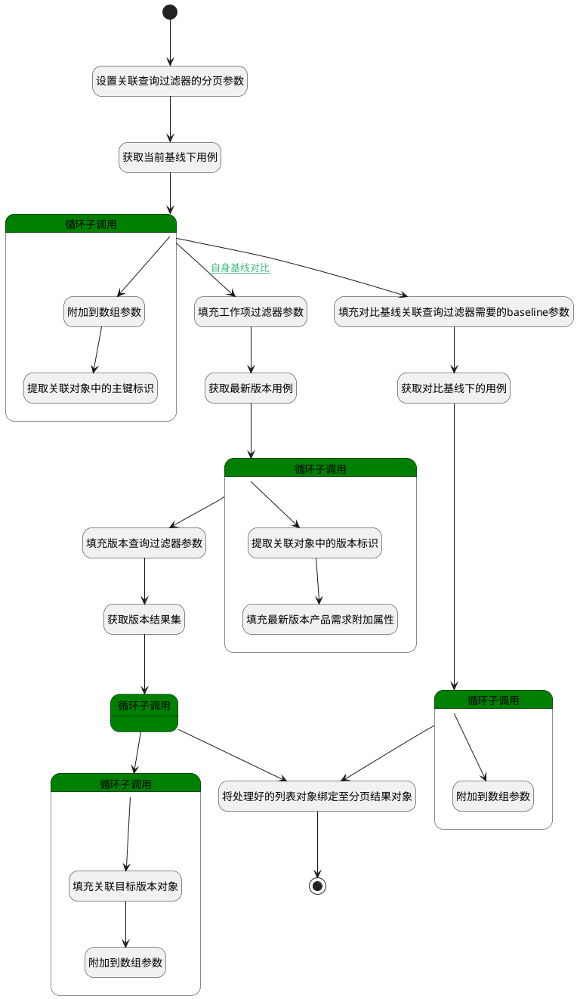

## 基线对比数据查询 <!-- {docsify-ignore-all} -->

   基线对比数据获取，查询两个基线下的关联用例

### 处理过程




### 处理步骤说明

#### 开始 :id=Begin<sup class="footnote-symbol"> <font color=gray size=1>[开始]</font></sup>


*- N/A*
#### 设置关联查询过滤器的分页参数 :id=PREPAREPARAM2<sup class="footnote-symbol"> <font color=gray size=1>[准备参数]</font></sup>


1. 将`500` 设置给  `Default(传入变量).size`
2. 将`500` 设置给  `comparison_filter(对比基线查询过滤器).size`

#### 获取当前基线下用例 :id=DEDATASET1<sup class="footnote-symbol"> <font color=gray size=1>[实体数据集]</font></sup>


调用实体 [基线用例(BASELINE_TEST_CASE)](module/TestMgmt/baseline_test_case.md) 数据集合 [填充测试用例版本数据(fill_version_data)](module/TestMgmt/baseline_test_case#数据集合) ，查询参数为`Default(传入变量)`

将执行结果返回给参数`page(分页查询结果变量)`

#### 循环子调用 :id=LOOPSUBCALL1<sup class="footnote-symbol"> <font color=gray size=1>[循环子调用]</font></sup>


循环参数`page(分页查询结果变量)`，子循环参数使用`for_temp_obj(循环临时变量)`
#### 附加到数组参数 :id=APPENDPARAM2<sup class="footnote-symbol"> <font color=gray size=1>[附加到数组参数]</font></sup>


将参数`for_temp_obj(循环临时变量)` 添加到数组参数`content(基线工作项列表)`
#### 提取关联对象中的主键标识 :id=RAWSFCODE1<sup class="footnote-symbol"> <font color=gray size=1>[直接后台代码]</font></sup>


<p class="panel-title"><b>执行代码[JavaScript]</b></p>

```javascript
var test_case_ids = logic.getParam("test_case_ids");
var for_temp_obj = logic.getParam("for_temp_obj");
if(for_temp_obj.get("target_id")){
    var ids = test_case_ids.get("ids");
    if(ids){
        ids = ids + "," + for_temp_obj.get("target_id");
    } else {
        ids = for_temp_obj.get("target_id");
    }
    test_case_ids.set("ids", ids);
}
```

#### 填充工作项过滤器参数 :id=PREPAREPARAM3<sup class="footnote-symbol"> <font color=gray size=1>[准备参数]</font></sup>


1. 将`test_case_ids(承载用例标识对象).ids` 设置给  `test_case_filter(用例查询过滤器).n_id_in`
2. 将`500` 设置给  `test_case_filter(用例查询过滤器).size`

#### 填充对比基线关联查询过滤器需要的baseline参数 :id=PREPAREPARAM1<sup class="footnote-symbol"> <font color=gray size=1>[准备参数]</font></sup>


1. 将`Default(传入变量).comparison_baseline` 设置给  `comparison_filter(对比基线查询过滤器).baseline(基线)`

#### 获取对比基线下的用例 :id=DEDATASET2<sup class="footnote-symbol"> <font color=gray size=1>[实体数据集]</font></sup>


调用实体 [基线用例(BASELINE_TEST_CASE)](module/TestMgmt/baseline_test_case.md) 数据集合 [填充测试用例版本数据(fill_version_data)](module/TestMgmt/baseline_test_case#数据集合) ，查询参数为`comparison_filter(对比基线查询过滤器)`

将执行结果返回给参数`comparison_page(对比基线下工作项分页结果)`

#### 获取最新版本用例 :id=DEDATASET3<sup class="footnote-symbol"> <font color=gray size=1>[实体数据集]</font></sup>


调用实体 [用例(TEST_CASE)](module/TestMgmt/test_case.md) 数据集合 [数据集(DEFAULT)](module/TestMgmt/test_case#数据集合) ，查询参数为`test_case_filter(用例查询过滤器)`

将执行结果返回给参数`test_case_page(用例分页结果变量)`

#### 填充最新版本产品需求附加属性 :id=PREPAREPARAM7<sup class="footnote-symbol"> <font color=gray size=1>[准备参数]</font></sup>


1. 将`test_case_for_temp(用例循环临时变量).CUR_VERSION_ID(当前版本标识)` 设置给  `test_case_for_temp(用例循环临时变量).target_version_id`
2. 将`test_case_for_temp(用例循环临时变量).ID(标识)` 设置给  `test_case_for_temp(用例循环临时变量).target_id`
3. 将`Default(传入变量).comparison_baseline` 设置给  `test_case_for_temp(用例循环临时变量).principal_id`
4. 将`1` 设置给  `test_case_for_temp(用例循环临时变量).is_latest`

#### 提取关联对象中的版本标识 :id=RAWSFCODE2<sup class="footnote-symbol"> <font color=gray size=1>[直接后台代码]</font></sup>


<p class="panel-title"><b>执行代码[JavaScript]</b></p>

```javascript
var test_case_versions = logic.getParam("test_case_versions");
var test_case_for_temp = logic.getParam("test_case_for_temp");
if(test_case_for_temp.get("cur_version_id")){
    var version_id_in = test_case_versions.get("version_id_in");
    if(version_id_in){
        version_id_in = version_id_in + "," + test_case_for_temp.get("cur_version_id");
    } else {
        version_id_in = test_case_for_temp.get("cur_version_id");
    }
    test_case_versions.set("version_id_in", version_id_in);
}
```

#### 循环子调用 :id=LOOPSUBCALL3<sup class="footnote-symbol"> <font color=gray size=1>[循环子调用]</font></sup>


循环参数`test_case_page(用例分页结果变量)`，子循环参数使用`test_case_for_temp(用例循环临时变量)`
#### 循环子调用 :id=LOOPSUBCALL2<sup class="footnote-symbol"> <font color=gray size=1>[循环子调用]</font></sup>


循环参数`comparison_page(对比基线下工作项分页结果)`，子循环参数使用`for_temp_obj(循环临时变量)`
#### 附加到数组参数 :id=APPENDPARAM3<sup class="footnote-symbol"> <font color=gray size=1>[附加到数组参数]</font></sup>


将参数`for_temp_obj(循环临时变量)` 添加到数组参数`content(基线工作项列表)`
#### 填充版本查询过滤器参数 :id=PREPAREPARAM5<sup class="footnote-symbol"> <font color=gray size=1>[准备参数]</font></sup>


1. 将`test_case_versions(承载用例当前版本标识).version_id_in` 设置给  `version_filter(版本过滤器).n_id_in`
2. 将`500` 设置给  `version_filter(版本过滤器).size`

#### 将处理好的列表对象绑定至分页结果对象 :id=BINDPARAM1<sup class="footnote-symbol"> <font color=gray size=1>[绑定参数]</font></sup>


绑定参数`content(基线工作项列表)` 到 `page(分页查询结果变量)`
#### 获取版本结果集 :id=DEDATASET4<sup class="footnote-symbol"> <font color=gray size=1>[实体数据集]</font></sup>


调用实体 [版本(VERSION)](module/Base/version.md) 数据集合 [数据集(DEFAULT)](module/Base/version#数据集合) ，查询参数为`version_filter(版本过滤器)`

将执行结果返回给参数`version_page(版本分页结果变量)`

#### 结束 :id=END1<sup class="footnote-symbol"> <font color=gray size=1>[结束]</font></sup>


返回 `page(分页查询结果变量)`

#### 循环子调用 :id=LOOPSUBCALL5<sup class="footnote-symbol"> <font color=gray size=1>[循环子调用]</font></sup>


循环参数`version_page(版本分页结果变量)`，子循环参数使用`version_for_temp(版本循环临时变量)`
#### 循环子调用 :id=LOOPSUBCALL4<sup class="footnote-symbol"> <font color=gray size=1>[循环子调用]</font></sup>


循环参数`test_case_page(用例分页结果变量)`，子循环参数使用`test_case_for_temp(用例循环临时变量)`
#### 填充关联目标版本对象 :id=PREPAREPARAM6<sup class="footnote-symbol"> <font color=gray size=1>[准备参数]</font></sup>


1. 将`version_for_temp(版本循环临时变量)` 设置给  `test_case_for_temp(用例循环临时变量).target_version`

#### 附加到数组参数 :id=APPENDPARAM4<sup class="footnote-symbol"> <font color=gray size=1>[附加到数组参数]</font></sup>


将参数`test_case_for_temp(用例循环临时变量)` 添加到数组参数`content(基线工作项列表)`

### 连接条件说明
#### 不同基线之间对比 


#### 自身基线对比 


#### 自身基线对比 :id=LOOPSUBCALL1-PREPAREPARAM3

 AND `page(分页查询结果变量).size` GT `0`
#### 若版本标识与用例的当前版本一致 


### 实体逻辑参数

|    中文名   |    代码名    |  数据类型    |  实体   |备注 |
| --------| --------| -------- | -------- | --------   |
|传入变量(<i class="fa fa-check"/></i>)|Default|过滤器|||
|对比基线查询过滤器|comparison_filter|过滤器|||
|对比基线下工作项分页结果|comparison_page|分页查询|||
|基线工作项列表|content|数据对象列表|[基线用例(BASELINE_TEST_CASE)](module/TestMgmt/baseline_test_case.md)||
|循环临时变量|for_temp_obj|数据对象|[基线用例(BASELINE_TEST_CASE)](module/TestMgmt/baseline_test_case.md)||
|分页查询结果变量|page|分页查询|||
|用例查询过滤器|test_case_filter|过滤器|||
|用例循环临时变量|test_case_for_temp|数据对象|[用例(TEST_CASE)](module/TestMgmt/test_case.md)||
|承载用例标识对象|test_case_ids|数据对象|[用例(TEST_CASE)](module/TestMgmt/test_case.md)||
|用例分页结果变量|test_case_page|分页查询|||
|承载用例当前版本标识|test_case_versions|数据对象|[用例(TEST_CASE)](module/TestMgmt/test_case.md)||
|版本过滤器|version_filter|过滤器|||
|版本循环临时变量|version_for_temp|数据对象|[版本(VERSION)](module/Base/version.md)||
|版本分页结果变量|version_page|分页查询|||
