## 移出基线 <!-- {docsify-ignore-all} -->

   将用例移出对应基线

### 处理过程

```plantuml
@startuml
hide empty description
<style>
root {
  HyperlinkColor #42b983
}
</style>

hide empty description
state "开始" as Begin <<start>> [[$./shift_out_baseline#begin {"开始"}]]
state "删除基线-用例关联数据" as DEACTION1  [[$./shift_out_baseline#deaction1 {"删除基线-用例关联数据"}]]
state "结束" as END1 <<end>> [[$./shift_out_baseline#end1 {"结束"}]]


Begin --> DEACTION1
DEACTION1 --> END1


@enduml
```

### 处理步骤说明

#### 开始 :id=Begin [开始]

*- N/A*
#### 删除基线-用例关联数据 :id=DEACTION1 [实体行为]

调用实体 [关联(RELATION)](module/Base/relation.md) 行为 [Remove](module/Base/relation#行为) ，行为参数为`Default(传入变量)`

#### 结束 :id=END1 [结束]

返回 `Default(传入变量)`

### 实体逻辑参数

|    中文名   |    代码名    |  数据类型    |  实体   |备注 |
| --------| --------| -------- | -------- | --------   |
|传入变量(<i class="fa fa-check"/></i>)|Default|数据对象|[基线用例(BASELINE_TEST_CASE)](module/TestMgmt/baseline_test_case.md)||
