## 生成阶段排序值 <!-- {docsify-ignore-all} -->

   生成阶段排序值

### 处理过程

```plantuml
@startuml
hide empty description
<style>
root {
  HyperlinkColor #42b983
}
</style>

hide empty description
state "开始" as Begin <<start>> [[$./fill_stage_order#begin {"开始"}]]
state "结束" as END1 <<end>> [[$./fill_stage_order#end1 {"结束"}]]
state "准备参数" as PREPAREPARAM1  [[$./fill_stage_order#prepareparam1 {"准备参数"}]]
state "设置排序值" as RAWSFCODE1  [[$./fill_stage_order#rawsfcode1 {"设置排序值"}]]
state "准备参数" as PREPAREPARAM3  [[$./fill_stage_order#prepareparam3 {"准备参数"}]]


Begin --> PREPAREPARAM1
PREPAREPARAM1 --> RAWSFCODE1
RAWSFCODE1 --> PREPAREPARAM3
PREPAREPARAM3 --> END1


@enduml
```




### 处理步骤说明

#### 开始 :id=Begin<sup class="footnote-symbol"> <font color=gray size=1>[开始]</font></sup>


*- N/A*
#### 结束 :id=END1<sup class="footnote-symbol"> <font color=gray size=1>[结束]</font></sup>


返回 `Default(传入变量)`

#### 准备参数 :id=PREPAREPARAM1<sup class="footnote-symbol"> <font color=gray size=1>[准备参数]</font></sup>


1. 将`Default(传入变量).REVIEW_STAGE(评审阶段)` 绑定给  `stage_list(阶段列表)`

#### 设置排序值 :id=RAWSFCODE1<sup class="footnote-symbol"> <font color=gray size=1>[直接后台代码]</font></sup>


<p class="panel-title"><b>执行代码[Groovy]</b></p>

```groovy
def stage_list = logic.param('stage_list').getReal();
def order = 1;
stage_list.each { stage ->
    println "Order: $order, Stage: $stage"
    stage.set("order", order);
    order++;
}

```

#### 准备参数 :id=PREPAREPARAM3<sup class="footnote-symbol"> <font color=gray size=1>[准备参数]</font></sup>


1. 将`stage_list(阶段列表)` 设置给  `Default(传入变量).REVIEW_STAGE(评审阶段)`


### 实体逻辑参数

|    中文名   |    代码名    |  数据类型    |  实体   |备注 |
| --------| --------| -------- | -------- | --------   |
|传入变量(<i class="fa fa-check"/></i>)|Default|数据对象|[流程准则(GUIDELINE)](module/TestMgmt/guideline.md)||
|阶段列表|stage_list|数据对象列表|[评审阶段(REVIEW_STAGE)](module/TestMgmt/review_stage.md)||
