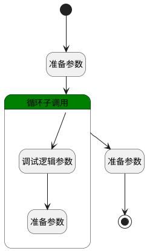

## 生成阶段排序值 <!-- {docsify-ignore-all} -->

   

### 处理过程

### 处理步骤说明

#### 开始 :id=Begin [开始]

*- N/A*
#### 结束 :id=END1 [结束]

返回 `Default(传入变量)`

#### 准备参数 :id=PREPAREPARAM1 [准备参数]

1. 将`Default(传入变量).REVIEW_STAGE(评审阶段)` 绑定给  `stage_list(阶段列表)`

#### 循环子调用 :id=LOOPSUBCALL1 [循环子调用]

循环参数`stage_list(阶段列表)`，子循环参数使用`for_stage(循环阶段数据)`
#### 准备参数 :id=PREPAREPARAM3 [准备参数]

1. 将`stage_arr(阶段数组)` 设置给  `Default(传入变量).REVIEW_STAGE(评审阶段)`

#### 调试逻辑参数 :id=DEBUGPARAM2 [调试逻辑参数]

> [!NOTE|label:调试信息|icon:fa fa-bug]
> 调试输出参数`for_stage(循环阶段数据)`的详细信息

#### 准备参数 :id=PREPAREPARAM2 [准备参数]

1. 将`for_stage(循环阶段数据).srfordervalue` 设置给  `for_stage(循环阶段数据).ORDER(顺序)`
2. 将`for_stage(循环阶段数据)` 追加到  `stage_arr(阶段数组)`

### 实体逻辑参数

|    中文名   |    代码名    |  数据类型    |  实体   |备注 |
| --------| --------| -------- | -------- | --------   |
|传入变量(<i class="fa fa-check"/></i>)|Default|数据对象|[流程准则(GUIDELINE)](module/TestMgmt/guideline.md)||
|循环阶段数据|for_stage|数据对象|[评审阶段(REVIEW_STAGE)](module/TestMgmt/review_stage.md)||
|阶段数组|stage_arr|数据对象列表|[评审阶段(REVIEW_STAGE)](module/TestMgmt/review_stage.md)||
|阶段列表|stage_list|数据对象列表|[评审阶段(REVIEW_STAGE)](module/TestMgmt/review_stage.md)||
