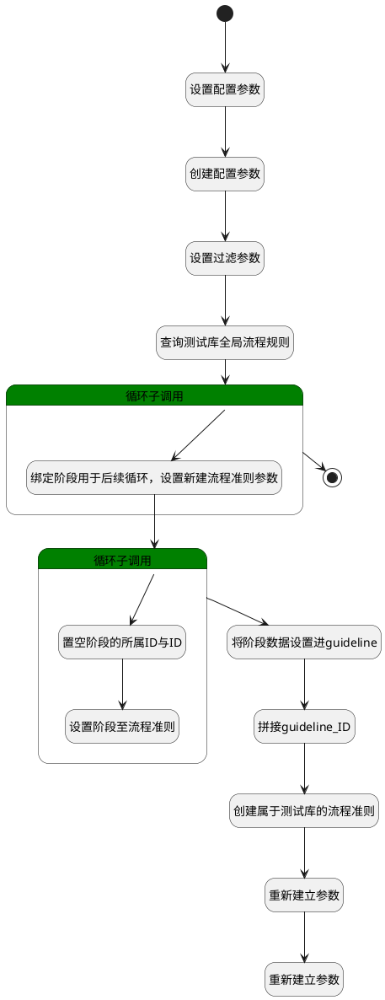

## 创建测试库流程准则 <!-- {docsify-ignore-all} -->

   创建测试库后，自动生成测试库内的评审规则

### 处理过程




### 处理步骤说明

#### 开始 :id=Begin<sup class="footnote-symbol"> <font color=gray size=1>[开始]</font></sup>


*- N/A*
#### 设置配置参数 :id=PREPAREPARAM7<sup class="footnote-symbol"> <font color=gray size=1>[准备参数]</font></sup>


1. 将`Default(传入变量).ID(标识)` 设置给  `parameter(系统参数).OWNER_ID(所属数据标识)`
2. 将`LIBRARY` 设置给  `parameter(系统参数).OWNER_TYPE(所属数据对象)`
3. 将`RUNFAILURE` 设置给  `parameter(系统参数).OWNER_SUBTYPE(所属对象子类型)`

#### 创建配置参数 :id=DEACTION2<sup class="footnote-symbol"> <font color=gray size=1>[实体行为]</font></sup>


调用实体 [系统参数(PARAMETER)](module/Base/parameter.md) 行为 [Create](module/Base/parameter#行为) ，行为参数为`parameter(系统参数)`

#### 设置过滤参数 :id=PREPAREPARAM2<sup class="footnote-symbol"> <font color=gray size=1>[准备参数]</font></sup>


1. 将`LIBRARY` 设置给  `guideline_filter(流程准则过滤器).N_OBJECT_TYPE_EQ`
2. 将`1` 设置给  `guideline_filter(流程准则过滤器).N_SCOPE_ID_ISNULL`

#### 查询测试库全局流程规则 :id=DEDATASET1<sup class="footnote-symbol"> <font color=gray size=1>[实体数据集]</font></sup>


调用实体 [流程准则(GUIDELINE)](module/TestMgmt/guideline.md) 数据集合 [数据集(DEFAULT)](module/TestMgmt/guideline#数据集合) ，查询参数为`guideline_filter(流程准则过滤器)`

将执行结果返回给参数`guideline_pages(评审准则分页结果)`

#### 循环子调用 :id=LOOPSUBCALL1<sup class="footnote-symbol"> <font color=gray size=1>[循环子调用]</font></sup>


循环参数`guideline_pages(评审准则分页结果)`，子循环参数使用`for_obj_guideline(循环评审准则临时变量)`
#### 绑定阶段用于后续循环，设置新建流程准则参数 :id=PREPAREPARAM4<sup class="footnote-symbol"> <font color=gray size=1>[准备参数]</font></sup>


1. 将`for_obj_guideline(循环评审准则临时变量).REVIEW_STAGE(评审阶段)` 绑定给  `review_stage_list(评审阶段列表)`
2. 将`for_obj_guideline(循环评审准则临时变量).IS_ENABLED(是否启用)` 设置给  `new_guideline(新评审规则).IS_ENABLED(是否启用)`
3. 将`for_obj_guideline(循环评审准则临时变量).NAME(名称)` 设置给  `new_guideline(新评审规则).NAME(名称)`
4. 将`for_obj_guideline(循环评审准则临时变量).SUBJECT_TYPE(主题类型)` 设置给  `new_guideline(新评审规则).SUBJECT_TYPE(主题类型)`
5. 将`for_obj_guideline(循环评审准则临时变量).OBJECT_TYPE(对象类型)` 设置给  `new_guideline(新评审规则).OBJECT_TYPE(对象类型)`
6. 将`Default(传入变量).ID(标识)` 设置给  `new_guideline(新评审规则).SCOPE_ID(所属主体标识)`

#### 循环子调用 :id=LOOPSUBCALL2<sup class="footnote-symbol"> <font color=gray size=1>[循环子调用]</font></sup>


循环参数`review_stage_list(评审阶段列表)`，子循环参数使用`for_obj_review_stage(循环阶段临时变量)`
#### 将阶段数据设置进guideline :id=PREPAREPARAM6<sup class="footnote-symbol"> <font color=gray size=1>[准备参数]</font></sup>


1. 将`stage_arr(阶段集合)` 设置给  `new_guideline(新评审规则).REVIEW_STAGE(评审阶段)`

#### 拼接guideline_ID :id=RAWSFCODE1<sup class="footnote-symbol"> <font color=gray size=1>[直接后台代码]</font></sup>


<p class="panel-title"><b>执行代码[JavaScript]</b></p>

```javascript
var new_guideline = logic.getParam("new_guideline");
var for_obj_guideline = logic.getParam("for_obj_guideline");
new_guideline.set("id",new_guideline.get("scope_id")+"_"+for_obj_guideline.get("id"));
```

#### 创建属于测试库的流程准则 :id=DEACTION3<sup class="footnote-symbol"> <font color=gray size=1>[实体行为]</font></sup>


调用实体 [流程准则(GUIDELINE)](module/TestMgmt/guideline.md) 行为 [Create](module/TestMgmt/guideline#行为) ，行为参数为`new_guideline(新评审规则)`

#### 结束 :id=END1<sup class="footnote-symbol"> <font color=gray size=1>[结束]</font></sup>


*- N/A*

#### 置空阶段的所属ID与ID :id=PREPAREPARAM3<sup class="footnote-symbol"> <font color=gray size=1>[准备参数]</font></sup>


1. 将`无值（NONE）` 设置给  `for_obj_review_stage(循环阶段临时变量).GUIDELINE_ID(准则标识)`
2. 将`无值（NONE）` 设置给  `for_obj_review_stage(循环阶段临时变量).ID(标识)`

#### 重新建立参数 :id=RENEWPARAM1<sup class="footnote-symbol"> <font color=gray size=1>[重新建立参数]</font></sup>


重建参数```new_guideline(新评审规则)```
#### 设置阶段至流程准则 :id=PREPAREPARAM5<sup class="footnote-symbol"> <font color=gray size=1>[准备参数]</font></sup>


1. 将`for_obj_review_stage(循环阶段临时变量)` 追加到  `stage_arr(阶段集合).REVIEW_STAGE`

#### 重新建立参数 :id=RENEWPARAM2<sup class="footnote-symbol"> <font color=gray size=1>[重新建立参数]</font></sup>


重建参数```stage_arr(阶段集合)```


### 实体逻辑参数

|    中文名   |    代码名    |  数据类型    |  实体   |备注 |
| --------| --------| -------- | -------- | --------   |
|传入变量(<i class="fa fa-check"/></i>)|Default|数据对象|[测试库(LIBRARY)](module/TestMgmt/library.md)||
|循环评审准则临时变量|for_obj_guideline|数据对象|[流程准则(GUIDELINE)](module/TestMgmt/guideline.md)||
|循环阶段临时变量|for_obj_review_stage|数据对象|[评审阶段(REVIEW_STAGE)](module/TestMgmt/review_stage.md)||
|评审规则|guideline|数据对象|[流程准则(GUIDELINE)](module/TestMgmt/guideline.md)||
|流程准则过滤器|guideline_filter|过滤器|||
|评审准则分页结果|guideline_pages|分页查询|||
|新评审规则|new_guideline|数据对象|[流程准则(GUIDELINE)](module/TestMgmt/guideline.md)||
|新评审阶段|new_review_stage|数据对象|[评审阶段(REVIEW_STAGE)](module/TestMgmt/review_stage.md)||
|系统参数|parameter|数据对象|[系统参数(PARAMETER)](module/Base/parameter.md)||
|评审阶段列表|review_stage_list|数据对象列表|[评审阶段(REVIEW_STAGE)](module/TestMgmt/review_stage.md)||
|阶段集合|stage_arr|数据对象列表|[评审阶段(REVIEW_STAGE)](module/TestMgmt/review_stage.md)||
