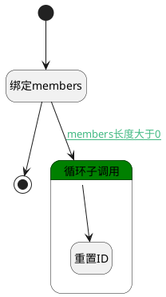

## 创建之前 <!-- {docsify-ignore-all} -->

   创建测试库之前，对添加的测试库成员进行处理

### 处理过程

### 处理步骤说明

#### 开始 :id=Begin [开始]

*- N/A*
#### 绑定members :id=BINDPARAM1 [绑定参数]

绑定参数`Default(传入变量)` 到 `members(测试库成员)`
#### 结束 :id=END1 [结束]

返回 `Default(传入变量)`

#### 循环子调用 :id=LOOPSUBCALL1 [循环子调用]

循环参数`members(测试库成员)`，子循环参数使用`member(单个成员)`
#### 重置ID :id=PREPAREPARAM1 [准备参数]

1. 将`空值（NULL）` 设置给  `member(单个成员).ID(标识)`

### 连接条件说明
#### members长度大于0 :id=BINDPARAM1-LOOPSUBCALL1

`members(测试库成员).size` GT `0`

### 实体逻辑参数

|    中文名   |    代码名    |  数据类型    |  实体   |备注 |
| --------| --------| -------- | -------- | --------   |
|传入变量(<i class="fa fa-check"/></i>)|Default|数据对象|[测试库(LIBRARY)](module/TestMgmt/library.md)||
|单个成员|member|数据对象|[测试库成员(LIBRARY_MEMBER)](module/TestMgmt/library_member.md)||
|测试库成员|members|数据对象列表|[测试库成员(LIBRARY_MEMBER)](module/TestMgmt/library_member.md)||
