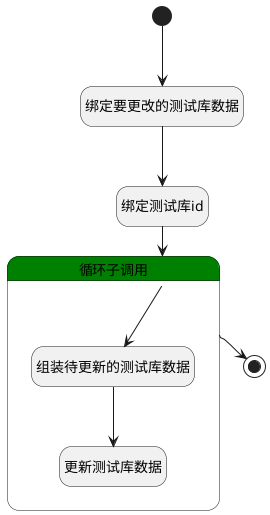

## 移动测试库 <!-- {docsify-ignore-all} -->

   更新测试库的所属、可见范围

### 处理过程

### 处理步骤说明

#### 开始 :id=Begin [开始]

*- N/A*
#### 绑定要更改的测试库数据 :id=BINDPARAM1 [绑定参数]

绑定参数`Default(传入变量)` 到 `srfactionparam(更改的数据)`
#### 绑定测试库id :id=BINDPARAM2 [绑定参数]

绑定参数`Default(传入变量)` 到 `id(测试库主键)`
#### 结束 :id=END1 [结束]

*- N/A*

#### 循环子调用 :id=LOOPSUBCALL1 [循环子调用]

循环参数`srfactionparam(更改的数据)`，子循环参数使用`for_temp(循环变量)`
#### 组装待更新的测试库数据 :id=PREPAREPARAM1 [准备参数]

1. 将`for_temp(循环变量).SCOPE_ID(所属对象)` 设置给  `temp_lirbary(测试库).SCOPE_ID(所属对象)`
2. 将`for_temp(循环变量).SCOPE_TYPE(所属)` 设置给  `temp_lirbary(测试库).SCOPE_TYPE(所属)`
3. 将`for_temp(循环变量).VISIBILITY(可见范围)` 设置给  `temp_lirbary(测试库).VISIBILITY(可见范围)`
4. 将`id(测试库主键)` 设置给  `temp_lirbary(测试库).ID(标识)`

#### 更新测试库数据 :id=DEACTION1 [实体行为]

调用实体 [测试库(LIBRARY)](module/TestMgmt/library.md) 行为 [Update](module/TestMgmt/library#行为) ，行为参数为`temp_lirbary(测试库)`

### 实体逻辑参数

|    中文名   |    代码名    |  数据类型    |  实体   |备注 |
| --------| --------| -------- | -------- | --------   |
|传入变量(<i class="fa fa-check"/></i>)|Default|数据对象|[测试库(LIBRARY)](module/TestMgmt/library.md)||
|循环变量|for_temp|数据对象|[测试库(LIBRARY)](module/TestMgmt/library.md)||
|测试库主键|id|简单数据|||
|更改的数据|srfactionparam|数据对象列表|[测试库(LIBRARY)](module/TestMgmt/library.md)||
|测试库|temp_lirbary|数据对象|[测试库(LIBRARY)](module/TestMgmt/library.md)||
