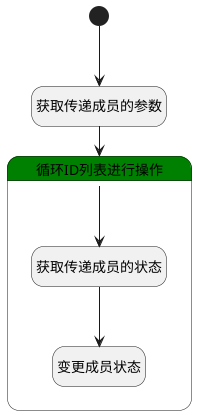

## 变更角色 <!-- {docsify-ignore-all} -->

   批量设置角色身份（role_id）

### 处理过程

### 处理步骤说明

#### 开始 :id=Begin [开始]

*- N/A*
#### 获取传递成员的参数 :id=BINDPARAM1 [绑定参数]

绑定参数`Default(传入变量)` 到 `srfactionparam(选择数据对象)`
#### 循环ID列表进行操作 :id=LOOPSUBCALL1 [循环子调用]

循环参数`srfactionparam(选择数据对象)`，子循环参数使用`for_temp_obj(循环临时变量)`
#### 获取传递成员的状态 :id=PREPAREPARAM2 [准备参数]

1. 将`for_temp_obj(循环临时变量).ROLE_ID(角色)` 设置给  `Default(传入变量).ROLE_ID(角色)`

#### 变更成员状态 :id=DEACTION1 [实体行为]

调用实体 [测试库成员(LIBRARY_MEMBER)](module/TestMgmt/library_member.md) 行为 [Update](module/TestMgmt/library_member#行为) ，行为参数为`Default(传入变量)`

### 实体逻辑参数

|    中文名   |    代码名    |  数据类型    |  实体   |备注 |
| --------| --------| -------- | -------- | --------   |
|传入变量(<i class="fa fa-check"/></i>)|Default|数据对象|[测试库成员(LIBRARY_MEMBER)](module/TestMgmt/library_member.md)||
|循环临时变量|for_temp_obj|数据对象|[测试库成员(LIBRARY_MEMBER)](module/TestMgmt/library_member.md)||
|选择数据对象|srfactionparam|数据对象列表|[测试库成员(LIBRARY_MEMBER)](module/TestMgmt/library_member.md)||
