## 新建临时管理员 <!-- {docsify-ignore-all} -->

   

### 处理过程

```plantuml
@startuml
hide empty description
<style>
root {
  HyperlinkColor #42b983
}
</style>

hide empty description
state "开始" as Begin <<start>> [[$./create_temp_admin#begin {"开始"}]]
state "准备参数" as PREPAREPARAM1  [[$./create_temp_admin#prepareparam1 {"准备参数"}]]
state "实体行为" as DEACTION1  [[$./create_temp_admin#deaction1 {"实体行为"}]]


Begin --> PREPAREPARAM1
PREPAREPARAM1 --> DEACTION1


@enduml
```

### 处理步骤说明

#### 开始 :id=Begin [开始]

*- N/A*
#### 准备参数 :id=PREPAREPARAM1 [准备参数]

1. 将`网页请求上下文[library] ==> Default[LIBRARY_ID]` 设置给  `Default(传入变量).LIBRARY_ID(测试库标识)`
2. 将`admin` 设置给  `Default(传入变量).ROLE_ID(角色)`
3. 将`用户全局对象.srfpersonid` 设置给  `Default(传入变量).USER_ID(登录名)`
4. 将`用户全局对象.srfpersonname` 设置给  `Default(传入变量).NAME(姓名)`

#### 实体行为 :id=DEACTION1 [实体行为]

调用实体 [测试库成员(LIBRARY_MEMBER)](module/TestMgmt/library_member.md) 行为 [CreateTemp](module/TestMgmt/library_member#行为) ，行为参数为`Default(传入变量)`

### 实体逻辑参数

|    中文名   |    代码名    |  数据类型    |  实体   |备注 |
| --------| --------| -------- | -------- | --------   |
|传入变量(<i class="fa fa-check"/></i>)|Default|数据对象|[测试库成员(LIBRARY_MEMBER)](module/TestMgmt/library_member.md)||
