## 跳转至成员设置 <!-- {docsify-ignore-all} -->

   通过路由跳转至测试库成员设置

### 处理过程

```plantuml
@startuml
hide footbox
<style>
root {
  HyperlinkColor #42b983
}
</style>

hide empty description
state "开始" as Begin <<start>> [[$./jump_to_member_set#begin {开始}]]
state "结束" as END1 <<end>> [[$./jump_to_member_set#end1 {结束}]]
state "设置确认信息" as PREPAREJSPARAM1  [[$./jump_to_member_set#preparejsparam1 {设置确认信息}]]
state "设置路由" as RAWJSCODE1  [[$./jump_to_member_set#rawjscode1 {设置路由}]]
state "操作提示" as MSGBOX1  [[$./jump_to_member_set#msgbox1 {操作提示}]]


Begin --> PREPAREJSPARAM1
PREPAREJSPARAM1 --> MSGBOX1
MSGBOX1 --> RAWJSCODE1
RAWJSCODE1 --> END1


@enduml
```




### 处理步骤说明

#### 开始 :id=Begin<sup class="footnote-symbol"> <font color=gray size=1>[开始]</font></sup>


#### 结束 :id=END1<sup class="footnote-symbol"> <font color=gray size=1>[结束]</font></sup>


#### 设置确认信息 :id=PREPAREJSPARAM1<sup class="footnote-symbol"> <font color=gray size=1>[准备参数]</font></sup>


1. 将`ok` 设置给  `msg(消息确认标识).ok`

#### 操作提示 :id=MSGBOX1<sup class="footnote-symbol"> <font color=gray size=1>[消息弹窗]</font></sup>


#### 设置路由 :id=RAWJSCODE1<sup class="footnote-symbol"> <font color=gray size=1>[直接前台代码]</font></sup>


<p class="panel-title"><b>执行代码</b></p>

```javascript
// 如果当前视图打开方式为普通模态，则先关闭模态再跳转
if (view.modal && view.modal.mode === 'MODAL') {
	view.modal.ignoreDismissCheck = true
	view.closeView({ ok: true })
}
ibiz.openView.push(`/-/index/library=${context.library}/library_index_view/srfnav=usrdrgroup1227882118/library_details_setting_tree_exp_view/srfnav=root%3Anormal%3Amember/library_member_config_grid_view/-`);
```

### 连接条件说明
#### 连接名称 


### 实体逻辑参数

|    中文名   |    代码名    |  数据类型      |备注 |
| --------| --------| --------  | --------   |
|消息确认标识|msg|数据对象||
|上一次返回参数|lastReturn|上一次调用返回||
|项目标识|project|数据对象||
|传入变量(<i class="fa fa-check"/></i>)|Default|数据对象||
|视图|view|当前视图对象||
