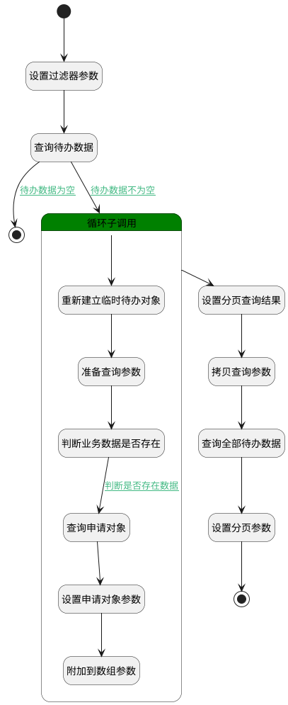

## 待办数据 <!-- {docsify-ignore-all} -->

   测试

### 处理过程




### 处理步骤说明

#### 开始 :id=Begin<sup class="footnote-symbol"> <font color=gray size=1>[开始]</font></sup>


*- N/A*
#### 设置过滤器参数 :id=PREPAREPARAM5<sup class="footnote-symbol"> <font color=gray size=1>[准备参数]</font></sup>


1. 将`空值（NULL）` 设置给  `Default(传入变量).searchconds`
2. 将`review` 设置给  `Default(传入变量).N_BIZTYPE_EQ`

#### 查询待办数据 :id=DEDATASET1<sup class="footnote-symbol"> <font color=gray size=1>[实体数据集]</font></sup>


调用实体 [待办(SYS_TODO)](module/ebsx/SysTodo.md) 数据集合 [当前用户数据(CurUser)](module/ebsx/SysTodo#数据集合) ，查询参数为`Default(传入变量)`

将执行结果返回给参数`sq_todo_data(申请待办数据)`

#### 循环子调用 :id=LOOPSUBCALL1<sup class="footnote-symbol"> <font color=gray size=1>[循环子调用]</font></sup>


循环参数`sq_todo_data(申请待办数据)`，子循环参数使用`temp_todo_obj(临时待办对象)`
#### 重新建立临时待办对象 :id=RENEWPARAM1<sup class="footnote-symbol"> <font color=gray size=1>[重新建立参数]</font></sup>


重建参数```temp_sq_obj(临时申请对象)```
#### 设置分页查询结果 :id=BINDPARAM1<sup class="footnote-symbol"> <font color=gray size=1>[绑定参数]</font></sup>


绑定参数`sq_data(申请工作流数据)` 到 `sq_data_page(申请数据分页对象)`
#### 准备查询参数 :id=PREPAREPARAM1<sup class="footnote-symbol"> <font color=gray size=1>[准备参数]</font></sup>


1. 将`temp_todo_obj(临时待办对象).BIZKEY(业务数据标识)` 设置给  `temp_sq_obj(临时申请对象).ID(标识)`

#### 结束 :id=END1<sup class="footnote-symbol"> <font color=gray size=1>[结束]</font></sup>


返回 `sq_data(申请工作流数据)`

#### 拷贝查询参数 :id=PREPAREPARAM4<sup class="footnote-symbol"> <font color=gray size=1>[准备参数]</font></sup>


1. 将`Default(传入变量)` 拷贝到  `temp_todo_filter(临时待办过滤器)`
2. 将`0` 设置给  `temp_todo_filter(临时待办过滤器).page`
3. 将`100000000` 设置给  `temp_todo_filter(临时待办过滤器).size`

#### 判断业务数据是否存在 :id=DEACTION2<sup class="footnote-symbol"> <font color=gray size=1>[实体行为]</font></sup>


调用实体 [评审(REVIEW)](module/TestMgmt/review.md) 行为 [CheckKey](module/TestMgmt/review#行为) ，行为参数为`temp_sq_obj(临时申请对象)`

将执行结果返回给参数`check_key_ret(返回结果)`

#### 查询全部待办数据 :id=DEDATASET2<sup class="footnote-symbol"> <font color=gray size=1>[实体数据集]</font></sup>


调用实体 [待办(SYS_TODO)](module/ebsx/SysTodo.md) 数据集合 [当前用户数据(CurUser)](module/ebsx/SysTodo#数据集合) ，查询参数为`temp_todo_filter(临时待办过滤器)`

将执行结果返回给参数`all_sq_data_page(全部待办对象)`

#### 查询申请对象 :id=DEACTION1<sup class="footnote-symbol"> <font color=gray size=1>[实体行为]</font></sup>


调用实体 [评审(REVIEW)](module/TestMgmt/review.md) 行为 [Get](module/TestMgmt/review#行为) ，行为参数为`temp_sq_obj(临时申请对象)`

将执行结果返回给参数`temp_sq_obj(临时申请对象)`

#### 结束 :id=END2<sup class="footnote-symbol"> <font color=gray size=1>[结束]</font></sup>


返回 `sq_data_page(申请数据分页对象)`

#### 设置分页参数 :id=PREPAREPARAM3<sup class="footnote-symbol"> <font color=gray size=1>[准备参数]</font></sup>


1. 将`all_sq_data_page(全部待办对象).total` 设置给  `sq_data_page(申请数据分页对象).total`

#### 设置申请对象参数 :id=PREPAREPARAM2<sup class="footnote-symbol"> <font color=gray size=1>[准备参数]</font></sup>


1. 将`temp_todo_obj(临时待办对象).PARAM01(参数01)` 设置给  `temp_sq_obj(临时申请对象).PARAM01`
2. 将`temp_todo_obj(临时待办对象).PARAM02(参数02)` 设置给  `temp_sq_obj(临时申请对象).PARAM02`
3. 将`temp_todo_obj(临时待办对象).PARAM03(参数03)` 设置给  `temp_sq_obj(临时申请对象).PARAM03`
4. 将`temp_todo_obj(临时待办对象).PARAM04(参数04)` 设置给  `temp_sq_obj(临时申请对象).PARAM04`
5. 将`temp_todo_obj(临时待办对象).PARAM05(参数05)` 设置给  `temp_sq_obj(临时申请对象).PARAM05`
6. 将`temp_todo_obj(临时待办对象).BIZKEY(业务数据标识)` 设置给  `temp_sq_obj(临时申请对象).BIZKEY`
7. 将`temp_todo_obj(临时待办对象).BIZTYPE(业务对象)` 设置给  `temp_sq_obj(临时申请对象).BIZTYPE`
8. 将`temp_todo_obj(临时待办对象).TODOID(待办标识)` 设置给  `temp_sq_obj(临时申请对象).TODOID`

#### 附加到数组参数 :id=APPENDPARAM1<sup class="footnote-symbol"> <font color=gray size=1>[附加到数组参数]</font></sup>


将参数`temp_sq_obj(临时申请对象)` 添加到数组参数`sq_data(申请工作流数据)` 的 `0` 位置

### 连接条件说明
#### 待办数据为空 :id=DEDATASET1-END1

`sq_todo_data(申请待办数据).size` EQ `0`
#### 待办数据不为空 :id=DEDATASET1-LOOPSUBCALL1

`sq_todo_data(申请待办数据).size` GT `0`
#### 判断是否存在数据 :id=DEACTION2-DEACTION1

`check_key_ret(返回结果)` NOTEQ `0`


### 实体逻辑参数

|    中文名   |    代码名    |  数据类型    |  实体   |备注 |
| --------| --------| -------- | -------- | --------   |
|传入变量(<i class="fa fa-check"/></i>)|Default|过滤器|||
|全部待办对象|all_sq_data_page|分页查询|||
|返回结果|check_key_ret|简单数据|||
|申请工作流数据|sq_data|数据对象列表|[评审(REVIEW)](module/TestMgmt/review.md)||
|申请数据分页对象|sq_data_page|分页查询|||
|申请待办数据|sq_todo_data|数据对象列表|[待办(SYS_TODO)](module/ebsx/SysTodo.md)||
|临时申请对象|temp_sq_obj|数据对象|[评审(REVIEW)](module/TestMgmt/review.md)||
|临时待办过滤器|temp_todo_filter|过滤器|||
|临时待办对象|temp_todo_obj|数据对象|[待办(SYS_TODO)](module/ebsx/SysTodo.md)||
