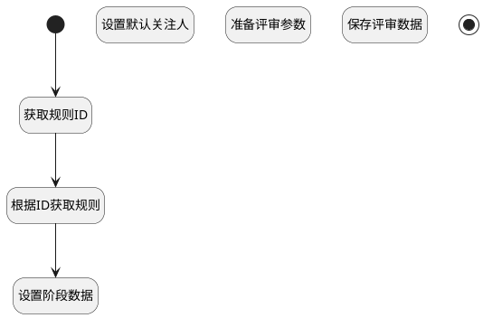

## 创建后附加评审规则 <!-- {docsify-ignore-all} -->

   在创建评审后，自动获取规则的值并赋予

### 处理过程

### 处理步骤说明

#### 获取规则ID :id=PREPAREPARAM3 [准备参数]

1. 将`Default(传入变量).GUIDELINE_ID(流程准则标识)` 设置给  `guideline_detail(选择的评审规则详情).ID(标识)`

#### 根据ID获取规则 :id=DEACTION1 [实体行为]

调用实体 [流程准则(GUIDELINE)](module/TestMgmt/guideline.md) 行为 [Get](module/TestMgmt/guideline#行为) ，行为参数为`guideline_detail(选择的评审规则详情)`

将执行结果返回给参数`guideline_detail(选择的评审规则详情)`

#### 设置阶段数据 :id=PREPAREPARAM2 [准备参数]

1. 将`guideline_detail(选择的评审规则详情).REVIEW_STAGE(评审阶段)` 设置给  `Default(传入变量).STAGE(阶段)`
2. 将`guideline_detail(选择的评审规则详情).SUBJECT_TYPE(主题类型)` 设置给  `Default(传入变量).TYPE(评审类型)`

#### 设置默认关注人 :id=PREPAREPARAM4 [准备参数]

1. 将`Default(传入变量).ID(标识)` 设置给  `cur_user(当前用户).OWNER_ID(所属数据标识)`
2. 将`40` 设置给  `cur_user(当前用户).TYPE(关注类型)`
3. 将`REVIEW` 设置给  `cur_user(当前用户).OWNER_SUBTYPE(所属对象子类型)`
4. 将`用户全局对象.srfpersonid` 设置给  `cur_user(当前用户).USER_ID(关注人)`
5. 将`用户全局对象.srfpersonname` 设置给  `cur_user(当前用户).NAME(名称)`
6. 将`REVIEW` 设置给  `cur_user(当前用户).OWNER_TYPE(所属数据对象)`

#### 开始 :id=Begin [开始]

*- N/A*
#### 准备评审参数 :id=PREPAREPARAM5 [准备参数]

1. 将`cur_user(当前用户)` 追加到  `attentions(关注人)`
2. 将`attentions(关注人)` 设置给  `Default(传入变量).ATTENTIONS(关注)`

#### 保存评审数据 :id=DEACTION2 [实体行为]

调用实体 [评审(REVIEW)](module/TestMgmt/review.md) 行为 [Save](module/TestMgmt/review#行为) ，行为参数为`Default(传入变量)`

#### 结束 :id=END1 [结束]

*- N/A*

### 实体逻辑参数

|    中文名   |    代码名    |  数据类型    |  实体   |备注 |
| --------| --------| -------- | -------- | --------   |
|传入变量(<i class="fa fa-check"/></i>)|Default|数据对象|[评审(REVIEW)](module/TestMgmt/review.md)||
|关注人|attentions|数据对象列表|[关注(ATTENTION)](module/Base/attention.md)||
|当前用户|cur_user|数据对象|[关注(ATTENTION)](module/Base/attention.md)||
|选择的评审规则详情|guideline_detail|数据对象|[流程准则(GUIDELINE)](module/TestMgmt/guideline.md)||
