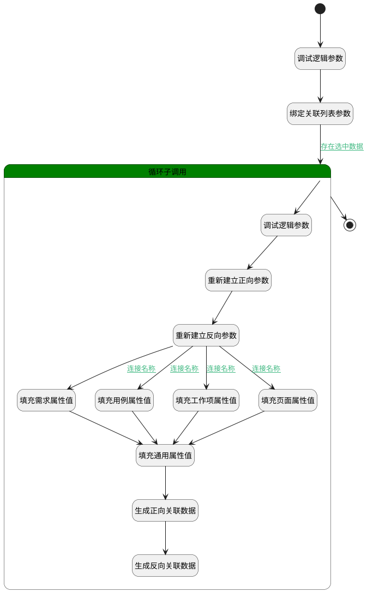

## 添加内容 <!-- {docsify-ignore-all} -->

   规划用例，将用例规划至评审内，生成正反向关联数据

### 处理过程




### 处理步骤说明

#### 开始 :id=Begin<sup class="footnote-symbol"> <font color=gray size=1>[开始]</font></sup>


*- N/A*
#### 调试逻辑参数 :id=DEBUGPARAM2<sup class="footnote-symbol"> <font color=gray size=1>[调试逻辑参数]</font></sup>


> [!NOTE|label:调试信息|icon:fa fa-bug]
> 调试输出参数`Default(传入变量)`的详细信息


#### 绑定关联列表参数 :id=BINDPARAM1<sup class="footnote-symbol"> <font color=gray size=1>[绑定参数]</font></sup>


绑定参数`Default(传入变量)` 到 `selectdata(关联列表)`
#### 循环子调用 :id=LOOPSUBCALL1<sup class="footnote-symbol"> <font color=gray size=1>[循环子调用]</font></sup>


循环参数`selectdata(关联列表)`，子循环参数使用`for_temp_obj(循环临时变量)`
#### 调试逻辑参数 :id=DEBUGPARAM1<sup class="footnote-symbol"> <font color=gray size=1>[调试逻辑参数]</font></sup>


> [!NOTE|label:调试信息|icon:fa fa-bug]
> 调试输出参数`for_temp_obj(循环临时变量)`的详细信息


#### 重新建立正向参数 :id=RENEWPARAM1<sup class="footnote-symbol"> <font color=gray size=1>[重新建立参数]</font></sup>


重建参数```forward_relation_obj(正向关系对象)```
#### 重新建立反向参数 :id=RENEWPARAM2<sup class="footnote-symbol"> <font color=gray size=1>[重新建立参数]</font></sup>


重建参数```reverse_relation_obj(反向关系对象)```
#### 填充需求属性值 :id=PREPAREPARAM2<sup class="footnote-symbol"> <font color=gray size=1>[准备参数]</font></sup>


1. 将`IDEA` 设置给  `forward_relation_obj(正向关系对象).TARGET_TYPE(关联目标类型)`
2. 将`IDEA` 设置给  `reverse_relation_obj(反向关系对象).PRINCIPAL_TYPE(关联主体类型)`

#### 填充用例属性值 :id=PREPAREPARAM3<sup class="footnote-symbol"> <font color=gray size=1>[准备参数]</font></sup>


1. 将`TEST_CASE` 设置给  `forward_relation_obj(正向关系对象).TARGET_TYPE(关联目标类型)`
2. 将`TEST_CASE` 设置给  `reverse_relation_obj(反向关系对象).PRINCIPAL_TYPE(关联主体类型)`

#### 填充工作项属性值 :id=PREPAREPARAM4<sup class="footnote-symbol"> <font color=gray size=1>[准备参数]</font></sup>


1. 将`WORK_ITEM` 设置给  `forward_relation_obj(正向关系对象).TARGET_TYPE(关联目标类型)`
2. 将`WORK_ITEM` 设置给  `reverse_relation_obj(反向关系对象).PRINCIPAL_TYPE(关联主体类型)`

#### 填充页面属性值 :id=PREPAREPARAM5<sup class="footnote-symbol"> <font color=gray size=1>[准备参数]</font></sup>


1. 将`PAGE` 设置给  `forward_relation_obj(正向关系对象).TARGET_TYPE(关联目标类型)`
2. 将`PAGE` 设置给  `reverse_relation_obj(反向关系对象).PRINCIPAL_TYPE(关联主体类型)`

#### 结束 :id=END1<sup class="footnote-symbol"> <font color=gray size=1>[结束]</font></sup>


*- N/A*

#### 填充通用属性值 :id=PREPAREPARAM1<sup class="footnote-symbol"> <font color=gray size=1>[准备参数]</font></sup>


1. 将`Default(传入变量).id(标识)` 设置给  `forward_relation_obj(正向关系对象).PRINCIPAL_ID(关联主体标识)`
2. 将`for_temp_obj(循环临时变量).change_type` 设置给  `forward_relation_obj(正向关系对象).CHANGE_TYPE(变更类型)`
3. 将`for_temp_obj(循环临时变量).change_version` 设置给  `forward_relation_obj(正向关系对象).change_version(变更版本)`
4. 将`for_temp_obj(循环临时变量).id(标识)` 设置给  `reverse_relation_obj(反向关系对象).PRINCIPAL_ID(关联主体标识)`
5. 将`Default(传入变量).id(标识)` 设置给  `reverse_relation_obj(反向关系对象).TARGET_ID(目标主体标识)`
6. 将`REVIEW` 设置给  `forward_relation_obj(正向关系对象).PRINCIPAL_TYPE(关联主体类型)`
7. 将`REVIEW` 设置给  `reverse_relation_obj(反向关系对象).TARGET_TYPE(关联目标类型)`
8. 将`for_temp_obj(循环临时变量).id(标识)` 设置给  `forward_relation_obj(正向关系对象).TARGET_ID(关联目标标识)`

#### 生成正向关联数据 :id=DEACTION1<sup class="footnote-symbol"> <font color=gray size=1>[实体行为]</font></sup>


调用实体 [评审内容(REVIEW_CONTENT)](module/TestMgmt/review_content.md) 行为 [Save](module/TestMgmt/review_content#行为) ，行为参数为`forward_relation_obj(正向关系对象)`

#### 生成反向关联数据 :id=DEACTION2<sup class="footnote-symbol"> <font color=gray size=1>[实体行为]</font></sup>


调用实体 [关联(RELATION)](module/Base/relation.md) 行为 [Save](module/Base/relation#行为) ，行为参数为`reverse_relation_obj(反向关系对象)`


### 连接条件说明
#### 存在选中数据 :id=BINDPARAM1-LOOPSUBCALL1

`selectdata(关联列表).size` GT `0`
#### 连接名称 :id=RENEWPARAM2-PREPAREPARAM2

`Default(传入变量).tag` EQ `IDEA`
#### 连接名称 :id=RENEWPARAM2-PREPAREPARAM3

`Default(传入变量).tag` EQ `TEST_CASE`
#### 连接名称 :id=RENEWPARAM2-PREPAREPARAM4

`Default(传入变量).tag` EQ `WORK_ITEM`
#### 连接名称 :id=RENEWPARAM2-PREPAREPARAM5

`Default(传入变量).tag` EQ `PAGE`


### 实体逻辑参数

|    中文名   |    代码名    |  数据类型    |  实体   |备注 |
| --------| --------| -------- | -------- | --------   |
|传入变量(<i class="fa fa-check"/></i>)|Default|数据对象|[评审(REVIEW)](module/TestMgmt/review.md)||
|循环临时变量|for_temp_obj|数据对象|[评审(REVIEW)](module/TestMgmt/review.md)||
|正向关系对象|forward_relation_obj|数据对象|[评审内容(REVIEW_CONTENT)](module/TestMgmt/review_content.md)||
|反向关系对象|reverse_relation_obj|数据对象|[关联(RELATION)](module/Base/relation.md)||
|关联列表|selectdata|数据对象列表|[评审(REVIEW)](module/TestMgmt/review.md)||
