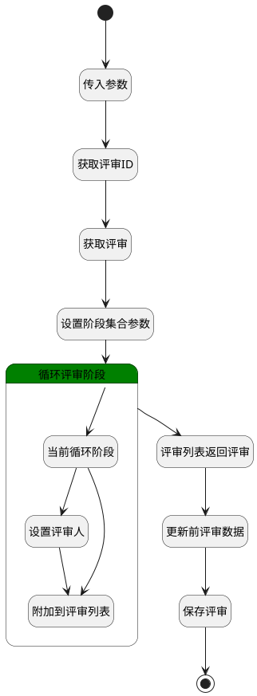

## 变更评审内阶段 <!-- {docsify-ignore-all} -->

   变更评审内阶段

### 处理过程

### 处理步骤说明

#### 开始 :id=Begin [开始]

*- N/A*
#### 结束 :id=END1 [结束]

*- N/A*

#### 传入参数 :id=DEBUGPARAM1 [调试逻辑参数]

> [!NOTE|label:调试信息|icon:fa fa-bug]
> 调试输出参数`Default(传入变量)`的详细信息

#### 获取评审ID :id=PREPAREPARAM1 [准备参数]

1. 将`Default(传入变量).review_id` 设置给  `review_info(评审信息).ID(标识)`

#### 获取评审 :id=DEACTION1 [实体行为]

调用实体 [评审(REVIEW)](module/TestMgmt/review.md) 行为 [Get](module/TestMgmt/review#行为) ，行为参数为`review_info(评审信息)`

#### 设置阶段集合参数 :id=PREPAREPARAM5 [准备参数]

1. 将`review_info(评审信息).STAGE(阶段)` 绑定给  `stage_page(阶段分页结果)`

#### 循环评审阶段 :id=LOOPSUBCALL1 [循环子调用]

循环参数`stage_page(阶段分页结果)`，子循环参数使用`cur_stage(当前阶段)`
#### 评审列表返回评审 :id=PREPAREPARAM4 [准备参数]

1. 将`stage_list(阶段集合)` 设置给  `review_info(评审信息).STAGE(阶段)`

#### 更新前评审数据 :id=DEBUGPARAM3 [调试逻辑参数]

> [!NOTE|label:调试信息|icon:fa fa-bug]
> 调试输出参数`review_info(评审信息)`的详细信息

#### 保存评审 :id=DEACTION2 [实体行为]

调用实体 [评审(REVIEW)](module/TestMgmt/review.md) 行为 [Save](module/TestMgmt/review#行为) ，行为参数为`review_info(评审信息)`

#### 设置评审人 :id=PREPAREPARAM2 [准备参数]

1. 将`Default(传入变量).reviewer(评审人)` 设置给  `cur_stage(当前阶段).REVIEWER(评审人)`
2. 将`Default(传入变量).reviewer_name` 设置给  `cur_stage(当前阶段).REVIEWER_NAME(评审人名称)`

#### 当前循环阶段 :id=DEBUGPARAM2 [调试逻辑参数]

> [!NOTE|label:调试信息|icon:fa fa-bug]
> 调试输出参数`cur_stage(当前阶段)`的详细信息

#### 附加到评审列表 :id=PREPAREPARAM3 [准备参数]

1. 将`cur_stage(当前阶段)` 追加到  `stage_list(阶段集合)`

### 连接条件说明
#### 修改阶段为当前阶段 

#### 修改阶段不为当前阶段 

### 实体逻辑参数

|    中文名   |    代码名    |  数据类型    |  实体   |备注 |
| --------| --------| -------- | -------- | --------   |
|传入变量(<i class="fa fa-check"/></i>)|Default|数据对象|[评审(REVIEW)](module/TestMgmt/review.md)||
|当前阶段|cur_stage|数据对象|[评审阶段(REVIEW_STAGE)](module/TestMgmt/review_stage.md)||
|评审信息|review_info|数据对象|[评审(REVIEW)](module/TestMgmt/review.md)||
|阶段集合|stage_list|数据对象列表|[评审阶段(REVIEW_STAGE)](module/TestMgmt/review_stage.md)||
|阶段分页结果|stage_page|分页查询|||
