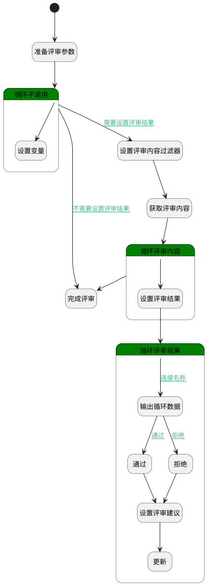

## 完成评审 <!-- {docsify-ignore-all} -->

   完成评审，修改评审状态以及设置那些未评审用例的评审结果

### 处理过程

### 处理步骤说明

#### 完成评审 :id=DEACTION2 [实体行为]

调用实体 [评审内容(REVIEW_CONTENT)](module/TestMgmt/review_content.md) 行为 [完成评审(complete_review)](module/TestMgmt/review_content#行为) ，行为参数为`Default(传入变量)`

#### 开始 :id=Begin [开始]

*- N/A*
#### 准备评审参数 :id=PREPAREPARAM9 [准备参数]

1. 将`Default(传入变量).srfactionparam` 绑定给  `srfactionparam(入参)`

#### 循环子调用 :id=LOOPSUBCALL3 [循环子调用]

循环参数`srfactionparam(入参)`，子循环参数使用`tmp_obj(循环变量)`
#### 设置评审内容过滤器 :id=PREPAREPARAM10 [准备参数]

1. 将`Default(传入变量).ID(标识)` 设置给  `content_fliter(评审内容过滤器).N_PRINCIPAL_ID_EQ`

#### 获取评审内容 :id=DEDATASET1 [实体数据集]

调用实体 [评审内容(REVIEW_CONTENT)](module/TestMgmt/review_content.md) 数据集合 [全部数据(all)](module/TestMgmt/review_content#数据集合) ，查询参数为`content_fliter(评审内容过滤器)`

将执行结果返回给参数`content_page(内容分页结果)`

#### 循环评审内容 :id=LOOPSUBCALL1 [循环子调用]

循环参数`content_page(内容分页结果)`，子循环参数使用`content_obj(评审内容循环变量)`
#### 设置变量 :id=PREPAREPARAM7 [准备参数]

1. 将`Default(传入变量).ID(标识)` 设置给  `review_obj(评审).ID(标识)`
2. 将`tmp_obj(循环变量).comment` 绑定给  `comment(评审意见)`
3. 将`tmp_obj(循环变量).stage_id` 设置给  `Default(传入变量).curstage_id`
4. 将`Default(传入变量).ID(标识)` 设置给  `Default(传入变量).principal_id(评审主体标识)`
5. 将`tmp_obj(循环变量).result` 绑定给  `result(评审结果)`
6. 将`tmp_obj(循环变量).case_number` 绑定给  `case_number(未完成评审用例数量)`

#### 设置评审结果 :id=PREPAREPARAM2 [准备参数]

1. 将`content_obj(评审内容循环变量).STAGE_RESULTS(评审结果)` 绑定给  `result_list(评审结果分页结果)`

#### 循环评审结果 :id=LOOPSUBCALL2 [循环子调用]

循环参数`result_list(评审结果分页结果)`，子循环参数使用`result_obj(评审结果循环变量)`
#### 输出循环数据 :id=DEBUGPARAM1 [调试逻辑参数]

> [!NOTE|label:调试信息|icon:fa fa-bug]
> 调试输出参数`result_obj(评审结果循环变量)`的详细信息

#### 通过 :id=PREPAREPARAM4 [准备参数]

1. 将`3` 设置给  `result_obj(评审结果循环变量).RESULT_STATE(状态)`

#### 拒绝 :id=PREPAREPARAM5 [准备参数]

1. 将`4` 设置给  `result_obj(评审结果循环变量).RESULT_STATE(状态)`

#### 设置评审建议 :id=PREPAREPARAM8 [准备参数]

1. 将`comment(评审意见)` 设置给  `result_obj(评审结果循环变量).COMMENT(评审意见)`

#### 更新 :id=DEACTION1 [实体行为]

调用实体 [评审结果(REVIEW_RESULT)](module/TestMgmt/review_result.md) 行为 [Update](module/TestMgmt/review_result#行为) ，行为参数为`result_obj(评审结果循环变量)`

### 连接条件说明
#### 需要设置评审结果 :id=LOOPSUBCALL3-PREPAREPARAM10

`case_number(未完成评审用例数量)` NOTEQ `0`
#### 连接名称 :id=LOOPSUBCALL2-DEBUGPARAM1

 AND `result_obj(评审结果循环变量).RESULT_STATE(状态)` EQ `1`
#### 通过 :id=DEBUGPARAM1-PREPAREPARAM4

`result(评审结果)` EQ `10`
#### 拒绝 :id=DEBUGPARAM1-PREPAREPARAM5

`result(评审结果)` EQ `20`
#### 不需要设置评审结果 :id=LOOPSUBCALL3-DEACTION2

`case_number(未完成评审用例数量)` EQ `0`

### 实体逻辑参数

|    中文名   |    代码名    |  数据类型    |  实体   |备注 |
| --------| --------| -------- | -------- | --------   |
|传入变量(<i class="fa fa-check"/></i>)|Default|数据对象|[评审(REVIEW)](module/TestMgmt/review.md)||
|未完成评审用例数量|case_number|简单数据|||
|评审意见|comment|简单数据|||
|评审内容过滤器|content_fliter|过滤器|||
|评审内容分页结果|content_list|数据对象列表|[评审内容(REVIEW_CONTENT)](module/TestMgmt/review_content.md)||
|评审内容循环变量|content_obj|数据对象|[评审内容(REVIEW_CONTENT)](module/TestMgmt/review_content.md)||
|内容分页结果|content_page|分页查询|||
|评审结果|result|简单数据||完成评审-评审状态（通过/拒绝）代码表中的值
10=通过，20=拒绝|
|评审结果分页结果|result_list|分页查询|||
|评审结果循环变量|result_obj|数据对象|[评审结果(REVIEW_RESULT)](module/TestMgmt/review_result.md)||
|评审|review_obj|数据对象|[评审(REVIEW)](module/TestMgmt/review.md)||
|入参|srfactionparam|数据对象列表|||
|循环变量|tmp_obj|数据对象|||
