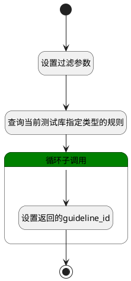

## 填充评审规则 <!-- {docsify-ignore-all} -->

   填充评审规则

### 处理过程

### 处理步骤说明

#### 开始 :id=Begin [开始]

*- N/A*
#### 结束 :id=END1 [结束]

返回 `guideline_detail(规则详情)`

#### 设置过滤参数 :id=PREPAREPARAM1 [准备参数]

1. 将`Default(传入变量).TYPE(评审类型)` 设置给  `guideline_filter(规则过滤器).N_SUBJECT_TYPE_EQ`
2. 将`LIBRARY` 设置给  `guideline_filter(规则过滤器).N_OBJECT_TYPE_EQ`
3. 将`Default(传入变量).LIBRARY_ID(测试库标识)` 设置给  `guideline_filter(规则过滤器).N_SCOPE_ID_EQ`

#### 查询当前测试库指定类型的规则 :id=DEDATASET1 [实体数据集]

调用实体 [流程准则(GUIDELINE)](module/TestMgmt/guideline.md) 数据集合 [数据集(DEFAULT)](module/TestMgmt/guideline#数据集合) ，查询参数为`guideline_filter(规则过滤器)`

将执行结果返回给参数`guideline_page(规则分页结果)`

#### 循环子调用 :id=LOOPSUBCALL1 [循环子调用]

循环参数`guideline_page(规则分页结果)`，子循环参数使用`guideline_detail(规则详情)`
#### 设置返回的guideline_id :id=PREPAREPARAM2 [准备参数]

1. 将`guideline_detail(规则详情).ID(标识)` 设置给  `guideline_detail(规则详情).guideline_id`

### 实体逻辑参数

|    中文名   |    代码名    |  数据类型    |  实体   |备注 |
| --------| --------| -------- | -------- | --------   |
|传入变量(<i class="fa fa-check"/></i>)|Default|数据对象|[评审(REVIEW)](module/TestMgmt/review.md)||
|规则详情|guideline_detail|数据对象|[流程准则(GUIDELINE)](module/TestMgmt/guideline.md)||
|规则过滤器|guideline_filter|过滤器|||
|规则分页结果|guideline_page|分页查询|||
