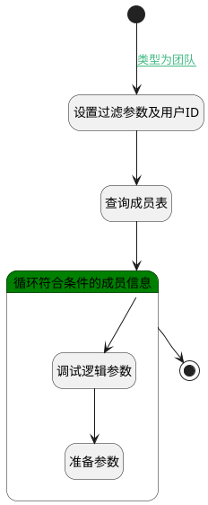

## 填充阶段评审人 <!-- {docsify-ignore-all} -->

   

### 处理过程

### 处理步骤说明

#### 开始 :id=Begin [开始]

*- N/A*
#### 结束 :id=END1 [结束]

返回 `Default(传入变量)`

#### 设置过滤参数及用户ID :id=PREPAREPARAM1 [准备参数]

1. 将`Default(传入变量).reviewer` 设置给  `filter(过滤器).N_OWNER_ID_EQ`
2. 将`用户全局对象.srfpersonid` 设置给  `Default(传入变量).cur_user_id`
3. 将`GROUP` 设置给  `filter(过滤器).N_OWNER_TYPE_EQ`

#### 查询成员表 :id=DEDATASET1 [实体数据集]

调用实体 [成员(MEMBER)](module/Base/member.md) 数据集合 [数据集(DEFAULT)](module/Base/member#数据集合) ，查询参数为`filter(过滤器)`

将执行结果返回给参数`member_page(成员分页数据)`

#### 循环符合条件的成员信息 :id=LOOPSUBCALL1 [循环子调用]

循环参数`member_page(成员分页数据)`，子循环参数使用`reviewer(评审人)`
#### 调试逻辑参数 :id=DEBUGPARAM2 [调试逻辑参数]

> [!NOTE|label:调试信息|icon:fa fa-bug]
> 调试输出参数`reviewer(评审人)`的详细信息

#### 准备参数 :id=PREPAREPARAM2 [准备参数]

1. 将`reviewer(评审人).USER_ID(登录名)` 设置给  `Default(传入变量).cur_reviewer_id`

### 连接条件说明
#### 类型为团队 :id=Begin-PREPAREPARAM1

`Default(传入变量).reviewer_type` EQ `30`
#### 进入循环 

### 实体逻辑参数

|    中文名   |    代码名    |  数据类型    |  实体   |备注 |
| --------| --------| -------- | -------- | --------   |
|传入变量(<i class="fa fa-check"/></i>)|Default|数据对象|[评审(REVIEW)](module/TestMgmt/review.md)||
|过滤器|filter|过滤器|||
|团队信息|group_obj|数据对象|[团队(GROUP)](module/Base/group.md)||
|成员分页数据|member_page|分页查询|||
|评审人|reviewer|数据对象|[成员(MEMBER)](module/Base/member.md)||
