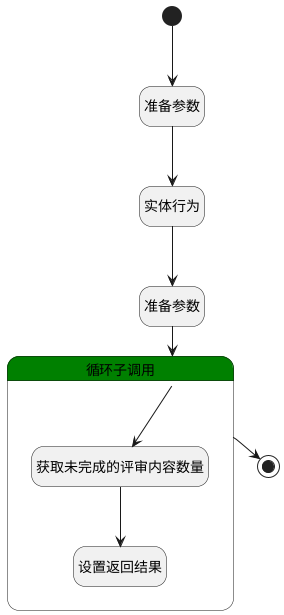

## 获取当前阶段信息 <!-- {docsify-ignore-all} -->

   获取当前阶段信息，用于完成评审按钮使用

### 处理过程




### 处理步骤说明

#### 开始 :id=Begin<sup class="footnote-symbol"> <font color=gray size=1>[开始]</font></sup>


*- N/A*
#### 准备参数 :id=PREPAREPARAM3<sup class="footnote-symbol"> <font color=gray size=1>[准备参数]</font></sup>


1. 将`Default(传入变量).review_id` 设置给  `review_obj(评审数据).ID(标识)`

#### 实体行为 :id=DEACTION2<sup class="footnote-symbol"> <font color=gray size=1>[实体行为]</font></sup>


调用实体 [评审(REVIEW)](module/TestMgmt/review.md) 行为 [Get](module/TestMgmt/review#行为) ，行为参数为`review_obj(评审数据)`

将执行结果返回给参数`review_obj(评审数据)`

#### 准备参数 :id=PREPAREPARAM4<sup class="footnote-symbol"> <font color=gray size=1>[准备参数]</font></sup>


1. 将`review_obj(评审数据).STAGE(阶段)` 绑定给  `stage_list(评审阶段列表)`

#### 循环子调用 :id=LOOPSUBCALL1<sup class="footnote-symbol"> <font color=gray size=1>[循环子调用]</font></sup>


循环参数`stage_list(评审阶段列表)`，子循环参数使用`for_stage_obj(循环数据)`
#### 获取未完成的评审内容数量 :id=RAWSQLCALL1<sup class="footnote-symbol"> <font color=gray size=1>[直接SQL调用]</font></sup>


<p class="panel-title"><b>执行sql语句</b></p>

```sql
SELECT
	sum( result ) as case_number
FROM
	(
	SELECT
	CASE
			
		WHEN
			t1.RESULT_STATE = 1 THEN
				1 ELSE 0 
			END result 
FROM
	review_result t1
	LEFT JOIN relation t2 ON t2.PRINCIPAL_ID = ?
WHERE
	t1.CONTENT_ID = t2.ID 
	AND t1.STAGE_ID = ? 
	) t
```

<p class="panel-title"><b>执行sql参数</b></p>

1. `Default(传入变量).review_id`
2. `Default(传入变量).stage_id`

重置参数`info(返回前端的信息)`，并将执行sql结果赋值给参数`info(返回前端的信息)`

#### 设置返回结果 :id=PREPAREPARAM6<sup class="footnote-symbol"> <font color=gray size=1>[准备参数]</font></sup>


1. 将`for_stage_obj(循环数据).NAME(名称)` 设置给  `info(返回前端的信息).stage_name1`
2. 将`for_stage_obj(循环数据).NAME(名称)` 设置给  `info(返回前端的信息).stage_name2`

#### 结束 :id=END1<sup class="footnote-symbol"> <font color=gray size=1>[结束]</font></sup>


返回 `info(返回前端的信息)`


### 连接条件说明
#### 连接名称 


### 实体逻辑参数

|    中文名   |    代码名    |  数据类型    |  实体   |备注 |
| --------| --------| -------- | -------- | --------   |
|传入变量(<i class="fa fa-check"/></i>)|Default|数据对象|[评审(REVIEW)](module/TestMgmt/review.md)||
|阶段过滤器|filter|过滤器|||
|循环数据|for_stage_obj|数据对象|[评审阶段(REVIEW_STAGE)](module/TestMgmt/review_stage.md)||
|返回前端的信息|info|数据对象|||
|评审数据|review_obj|数据对象|[评审(REVIEW)](module/TestMgmt/review.md)||
|评审阶段列表|stage_list|数据对象列表|[评审阶段(REVIEW_STAGE)](module/TestMgmt/review_stage.md)||
|评审阶段实体|stage_obj|数据对象|[评审阶段(REVIEW_STAGE)](module/TestMgmt/review_stage.md)||
