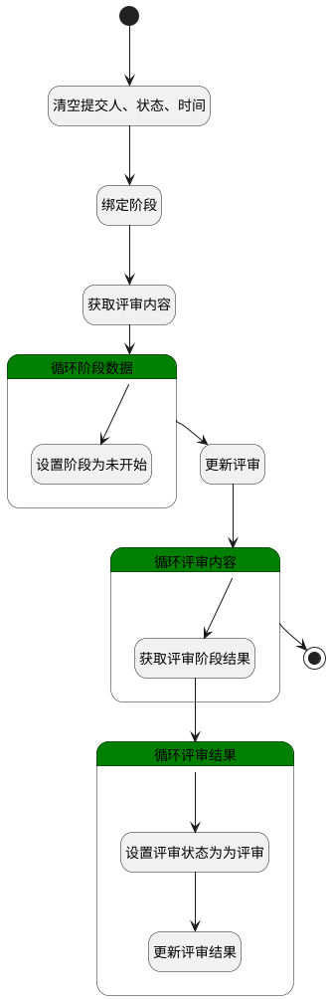

## 撤销评审 <!-- {docsify-ignore-all} -->

   撤销评审，并重置评审结果

### 处理过程

### 处理步骤说明

#### 开始 :id=Begin [开始]

*- N/A*
#### 清空提交人、状态、时间 :id=PREPAREPARAM1 [准备参数]

1. 将`空值（NULL）` 设置给  `Default(传入变量).SUBMITTER_NAME(提交人)`
2. 将`空值（NULL）` 设置给  `Default(传入变量).SUBMITTED_AT(提交时间)`
3. 将`空值（NULL）` 设置给  `Default(传入变量).SUBMITTER_ID(提交人标识)`
4. 将`50` 设置给  `Default(传入变量).STATE(评审状态)`

#### 绑定阶段 :id=PREPAREPARAM2 [准备参数]

全部阶段撤回

1. 将`Default(传入变量).STAGE(阶段)` 绑定给  `stages(评审阶段)`
2. 将`Default(传入变量).ID(标识)` 设置给  `content_filter(评审内容过滤器).N_PRINCIPAL_ID_EQ`
3. 将`REVIEW` 设置给  `content_filter(评审内容过滤器).N_PRINCIPAL_TYPE_EQ`

#### 获取评审内容 :id=DEDATASET1 [实体数据集]

调用实体 [评审内容(REVIEW_CONTENT)](module/TestMgmt/review_content.md) 数据集合 [全部数据(all)](module/TestMgmt/review_content#数据集合) ，查询参数为`content_filter(评审内容过滤器)`

将执行结果返回给参数`review_content(评审内容)`

#### 循环阶段数据 :id=LOOPSUBCALL1 [循环子调用]

循环参数`stages(评审阶段)`，子循环参数使用`stage(阶段)`
#### 设置阶段为未开始 :id=PREPAREPARAM3 [准备参数]

1. 将`10` 设置给  `stage(阶段).STAGE_STATE(评审阶段状态)`

#### 更新评审 :id=DEACTION1 [实体行为]

调用实体 [评审(REVIEW)](module/TestMgmt/review.md) 行为 [Update](module/TestMgmt/review#行为) ，行为参数为`Default(传入变量)`

#### 循环评审内容 :id=LOOPSUBCALL2 [循环子调用]

循环参数`review_content(评审内容)`，子循环参数使用`for_content(循环内容数据)`
#### 获取评审阶段结果 :id=PREPAREPARAM4 [准备参数]

1. 将`for_content(循环内容数据).stage_results(评审结果)` 绑定给  `results(评审结果)`

#### 循环评审结果 :id=LOOPSUBCALL3 [循环子调用]

循环参数`results(评审结果)`，子循环参数使用`result(结果)`
#### 设置评审状态为为评审 :id=PREPAREPARAM5 [准备参数]

1. 将`1` 设置给  `result(结果).RESULT_STATE(状态)`

#### 结束 :id=END1 [结束]

*- N/A*

#### 更新评审结果 :id=DEACTION2 [实体行为]

调用实体 [评审结果(REVIEW_RESULT)](module/TestMgmt/review_result.md) 行为 [Update](module/TestMgmt/review_result#行为) ，行为参数为`result(结果)`

### 实体逻辑参数

|    中文名   |    代码名    |  数据类型    |  实体   |备注 |
| --------| --------| -------- | -------- | --------   |
|传入变量(<i class="fa fa-check"/></i>)|Default|数据对象|[评审(REVIEW)](module/TestMgmt/review.md)||
|评审内容过滤器|content_filter|过滤器|||
|循环内容数据|for_content|数据对象|[评审内容(REVIEW_CONTENT)](module/TestMgmt/review_content.md)||
|结果|result|数据对象|[评审结果(REVIEW_RESULT)](module/TestMgmt/review_result.md)||
|评审结果|results|数据对象列表|[评审结果(REVIEW_RESULT)](module/TestMgmt/review_result.md)||
|评审内容|review_content|分页查询|||
|阶段|stage|数据对象|[评审阶段(REVIEW_STAGE)](module/TestMgmt/review_stage.md)||
|评审阶段|stages|数据对象列表|[评审阶段(REVIEW_STAGE)](module/TestMgmt/review_stage.md)||
