## 提交评审 <!-- {docsify-ignore-all} -->

   测试

### 处理过程

```plantuml
@startuml
hide empty description
<style>
root {
  HyperlinkColor #42b983
}
</style>

hide empty description
state "开始" as Begin <<start>> [[$./submit_review#begin {"开始"}]]
state "结束" as END1 <<end>> [[$./submit_review#end1 {"结束"}]]
state "启动流程" as STARTWF1  [[$./submit_review#startwf1 {"启动流程"}]]


Begin --> STARTWF1
STARTWF1 --> END1


@enduml
```

### 处理步骤说明

#### 开始 :id=Begin [开始]

*- N/A*
#### 结束 :id=END1 [结束]

*- N/A*

#### 启动流程 :id=STARTWF1 [启动流程]

启动实体流程 [用例评审](workflow/case_review_flow)，启动流程参数 `Default(传入变量)`

### 实体逻辑参数

|    中文名   |    代码名    |  数据类型    |  实体   |备注 |
| --------| --------| -------- | -------- | --------   |
|传入变量(<i class="fa fa-check"/></i>)|Default|数据对象|[评审(REVIEW)](module/TestMgmt/review.md)||
