## 计算表格列行为状态(review) <!-- {docsify-ignore-all} -->

   用于动态控制界面行为组按钮的显示隐藏状态

### 处理过程

```plantuml
@startuml
hide footbox
<style>
root {
  HyperlinkColor #42b983
}
</style>

hide empty description
state "开始" as Begin <<start>> [[$./calc_column_action_state#begin {开始}]]
state "结束" as END1 <<end>> [[$./calc_column_action_state#end1 {结束}]]
state "计算表格列行为状态" as RAWJSCODE1  [[$./calc_column_action_state#rawjscode1 {计算表格列行为状态}]]


Begin --> RAWJSCODE1
RAWJSCODE1 --> END1


@enduml
```




### 处理步骤说明

#### 开始 :id=Begin<sup class="footnote-symbol"> <font color=gray size=1>[开始]</font></sup>


#### 计算表格列行为状态 :id=RAWJSCODE1<sup class="footnote-symbol"> <font color=gray size=1>[直接前台代码]</font></sup>


<p class="panel-title"><b>执行代码</b></p>

```javascript
	const rows = uiLogic.grid.state.rows;
    const ctx = uiLogic.ctx;
	if (rows && rows.length > 0) {
		rows.forEach(row => {
			const titleColumn = row.uiActionGroupStates.name;
			const cur_user = ctx.srfuserid;
			const state = row.data.state;
			const create_man = row.data.create_man;
			if (titleColumn && Object.values(titleColumn).length > 0) {
				Object.values(titleColumn).forEach(action => {
                    action.visible = false;
                    if(action.uiActionId === 'delete@review'&& create_man == cur_user){
                        action.visible = true;
                    }else if (action.uiActionId === 'repeal_review@review'&& create_man == cur_user && state == '20' ) {
						action.visible = true;
					} else if (action.uiActionId === 'submit_review@review'&& create_man == cur_user && (state == '10'||state == '50') ) {
						action.visible = true;
					}else if (action.uiActionId === 'set_category@review'&& create_man == cur_user){
                        action.visible = true;
                    }
				})
			}
		})
	}

```

#### 结束 :id=END1<sup class="footnote-symbol"> <font color=gray size=1>[结束]</font></sup>


### 实体逻辑参数

|    中文名   |    代码名    |  数据类型      |备注 |
| --------| --------| --------  | --------   |
|上下文|ctx|导航视图参数绑定参数||
|传入变量(<i class="fa fa-check"/></i>)|Default|数据对象||
|表格|Grid|当前部件对象||
