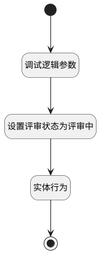

## 提交评审 <!-- {docsify-ignore-all} -->

   

### 处理过程

### 处理步骤说明

#### 开始 :id=Begin [开始]

#### 结束 :id=END1 [结束]

#### 调试逻辑参数 :id=DEBUGPARAM1 [调试逻辑参数]

> [!NOTE|label:调试信息|icon:fa fa-bug]
> 调试输出参数`传入变量`的详细信息

#### 设置评审状态为评审中 :id=PREPAREJSPARAM1 [准备参数]

1. 将`20` 设置给  `Default(传入变量).state`

#### 实体行为 :id=DEACTION1 [实体行为]

调用实体 [评审(REVIEW)](module/TestMgmt/review.md) 行为 [Update](module/TestMgmt/review#行为) ，行为参数为`Default(传入变量)`

### 实体逻辑参数

|    中文名   |    代码名    |  数据类型      |备注 |
| --------| --------| --------  | --------   |
|传入变量(<i class="fa fa-check"/></i>)|Default|数据对象||
