## 新建类别 <!-- {docsify-ignore-all} -->

   调用树节点新建方法新建类别

### 处理过程

```plantuml
@startuml
hide footbox
<style>
root {
  HyperlinkColor #42b983
}
</style>

hide empty description
state "开始" as Begin <<start>> [[$./create_category#begin {开始}]]
state "视图部件调用" as VIEWCTRLINVOKE1  [[$./create_category#viewctrlinvoke1 {视图部件调用}]]
state "需求参数" as PREPAREJSPARAM2  [[$./create_category#preparejsparam2 {需求参数}]]
state "通用参数" as PREPAREJSPARAM3  [[$./create_category#preparejsparam3 {通用参数}]]
state "用例参数" as PREPAREJSPARAM1  [[$./create_category#preparejsparam1 {用例参数}]]


Begin --> PREPAREJSPARAM1 : [[$./create_category#begin-preparejsparam1{测试库} 测试库]]
PREPAREJSPARAM1 --> PREPAREJSPARAM3
PREPAREJSPARAM3 --> VIEWCTRLINVOKE1
Begin --> PREPAREJSPARAM2 : [[$./create_category#begin-preparejsparam2{产品} 产品]]
PREPAREJSPARAM2 --> PREPAREJSPARAM3


@enduml
```




### 处理步骤说明

#### 用例参数 :id=PREPAREJSPARAM1<sup class="footnote-symbol"> <font color=gray size=1>[准备参数]</font></sup>


1. 将`context(上下文对象).library` 设置给  `defaultValue(默认值对象).owner_id`
2. 将`library` 设置给  `defaultValue(默认值对象).owner_type`
3. 将`library_review` 设置给  `defaultValue(默认值对象).owner_subtype`

#### 开始 :id=Begin<sup class="footnote-symbol"> <font color=gray size=1>[开始]</font></sup>


#### 通用参数 :id=PREPAREJSPARAM3<sup class="footnote-symbol"> <font color=gray size=1>[准备参数]</font></sup>


1. 将`node_9` 设置给  `node_param(节点参数).nodeType`
2. 将`defaultValue(默认值对象)` 设置给  `node_param(节点参数).defaultValue`

#### 视图部件调用 :id=VIEWCTRLINVOKE1<sup class="footnote-symbol"> <font color=gray size=1>[视图部件调用]</font></sup>


调用`treeexpbar_tree(树部件)`的方法`newTreeNode`，参数为`node_param(节点参数)`
#### 需求参数 :id=PREPAREJSPARAM2<sup class="footnote-symbol"> <font color=gray size=1>[准备参数]</font></sup>


1. 将`context(上下文对象).product` 设置给  `defaultValue(默认值对象).owner_id`
2. 将`product` 设置给  `defaultValue(默认值对象).owner_type`
3. 将`product_review` 设置给  `defaultValue(默认值对象).owner_subtype`

### 连接条件说明
#### 测试库 :id=Begin-PREPAREJSPARAM1

```context(上下文对象).library``` NOTEQ ```null``` AND ```context(上下文对象).library``` NOTEQ ```undefined```
#### 产品 :id=Begin-PREPAREJSPARAM2

```context(上下文对象).product``` NOTEQ ```null``` AND ```context(上下文对象).product``` NOTEQ ```undefined```


### 实体逻辑参数

|    中文名   |    代码名    |  数据类型      |备注 |
| --------| --------| --------  | --------   |
|树部件|treeexpbar_tree|部件对象||
|默认值对象|defaultValue|数据对象||
|节点参数|node_param|数据对象||
|传入变量(<i class="fa fa-check"/></i>)|Default|数据对象||
|上下文对象|context|导航视图参数绑定参数||
