## 跳转至工作流编辑视图 <!-- {docsify-ignore-all} -->

   

### 处理过程

```plantuml
@startuml
hide footbox
<style>
root {
  HyperlinkColor #42b983
}
</style>

hide empty description
state "开始" as Begin <<start>> [[$./jump_wf_edit_view#begin {开始}]]
state "注入脚本代码" as RAWJSCODE1  [[$./jump_wf_edit_view#rawjscode1 {注入脚本代码}]]
state "准备参数" as PREPAREJSPARAM1  [[$./jump_wf_edit_view#preparejsparam1 {准备参数}]]
state "结束" as END1 <<end>> [[$./jump_wf_edit_view#end1 {结束}]]


Begin --> PREPAREJSPARAM1
PREPAREJSPARAM1 --> RAWJSCODE1
RAWJSCODE1 --> END1


@enduml
```




### 处理步骤说明

#### 开始 :id=Begin<sup class="footnote-symbol"> <font color=gray size=1>[开始]</font></sup>


#### 结束 :id=END1<sup class="footnote-symbol"> <font color=gray size=1>[结束]</font></sup>


#### 准备参数 :id=PREPAREJSPARAM1<sup class="footnote-symbol"> <font color=gray size=1>[准备参数]</font></sup>


1. 将`Default(传入变量).param02` 设置给  `context(上下文).process.definition`
2. 将`Default(传入变量).param03` 设置给  `params(参数).taskDefinitionKey`
3. 将`Default(传入变量).id` 设置给  `context(上下文).dep2_licence_apply_ne`
4. 将`Default(传入变量).param03` 设置给  `context(上下文).taskdefinitionKey`

#### 注入脚本代码 :id=RAWJSCODE1<sup class="footnote-symbol"> <font color=gray size=1>[直接前台代码]</font></sup>


<p class="panel-title"><b>执行代码</b></p>

```javascript
ibiz.commands.execute("ibiz.app-view.open", "review_wf_dyna_edit_view", uiLogic.context,uiLogic.params);
```


### 实体逻辑参数

|    中文名   |    代码名    |  数据类型      |备注 |
| --------| --------| --------  | --------   |
|传入变量(<i class="fa fa-check"/></i>)|Default|数据对象||
|上下文|context|数据对象||
|参数|params|数据对象||
