## 刷新评审主视图 <!-- {docsify-ignore-all} -->

   

### 处理过程

```plantuml
@startuml
hide footbox
<style>
root {
  HyperlinkColor #42b983
}
</style>

hide empty description
state "开始" as Begin <<start>> [[$./refresh_main_view#begin {开始}]]
state "注入脚本代码" as RAWJSCODE2  [[$./refresh_main_view#rawjscode2 {注入脚本代码}]]
state "结束" as END1 <<end>> [[$./refresh_main_view#end1 {结束}]]
state "调试逻辑参数" as DEBUGPARAM1  [[$./refresh_main_view#debugparam1 {调试逻辑参数}]]
state "准备参数" as PREPAREJSPARAM1  [[$./refresh_main_view#preparejsparam1 {准备参数}]]
state "刷新页面" as RAWJSCODE1  [[$./refresh_main_view#rawjscode1 {刷新页面}]]


Begin --> DEBUGPARAM1
DEBUGPARAM1 --> PREPAREJSPARAM1
PREPAREJSPARAM1 --> RAWJSCODE2
RAWJSCODE2 --> RAWJSCODE1
RAWJSCODE1 --> END1


@enduml
```




### 处理步骤说明

#### 开始 :id=Begin<sup class="footnote-symbol"> <font color=gray size=1>[开始]</font></sup>


#### 结束 :id=END1<sup class="footnote-symbol"> <font color=gray size=1>[结束]</font></sup>


#### 调试逻辑参数 :id=DEBUGPARAM1<sup class="footnote-symbol"> <font color=gray size=1>[调试逻辑参数]</font></sup>


> [!NOTE|label:调试信息|icon:fa fa-bug]
> 调试输出参数`当前视图对象`的详细信息

#### 准备参数 :id=PREPAREJSPARAM1<sup class="footnote-symbol"> <font color=gray size=1>[准备参数]</font></sup>


1. 将`view(当前视图对象).parentView` 绑定给  `parent_view(父页面)`
2. 将`parent_view(父页面).layoutPanel.panelItems.form` 设置给  `parent_form(父表单)`

#### 注入脚本代码 :id=RAWJSCODE2<sup class="footnote-symbol"> <font color=gray size=1>[直接前台代码]</font></sup>


<p class="panel-title"><b>执行代码</b></p>

```javascript
uiLogic.parent_form.control.details.grouppanel6.state.visible=true;
uiLogic.parent_form.control.details.review_results.state.keepAlive=true;
uiLogic.parent_form.control.details.review_results.state.visible=false;

const choose_data = uiLogic.parent_form.control.details.choosed_content;
choose_data.setDataValue(null);
```

#### 刷新页面 :id=RAWJSCODE1<sup class="footnote-symbol"> <font color=gray size=1>[直接前台代码]</font></sup>


<p class="panel-title"><b>执行代码</b></p>

```javascript
ibiz.mc.command.update.send({ srfdecodename: 'review', srfkey: context.review})
```


### 实体逻辑参数

|    中文名   |    代码名    |  数据类型      |备注 |
| --------| --------| --------  | --------   |
|传入变量(<i class="fa fa-check"/></i>)|Default|数据对象||
|当前视图对象|view|当前视图对象||
|父页面|parent_view|数据对象||
|父表单|parent_form|数据对象||
