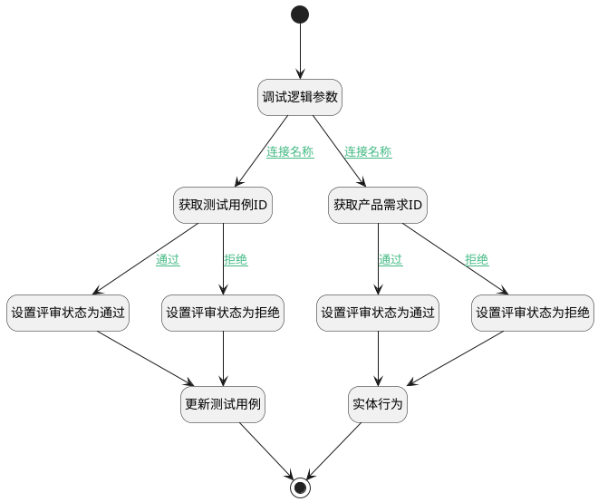

## 变更评审状态 <!-- {docsify-ignore-all} -->

   完成评审后变更测试用例的评审状态

### 处理过程

### 处理步骤说明

#### 设置评审状态为通过 :id=PREPAREPARAM2 [准备参数]

1. 将`3` 设置给  `test_case(测试用例).REVIEW_RESULT_STATE(评审结果)`

#### 更新测试用例 :id=DEACTION1 [实体行为]

调用实体 [用例(TEST_CASE)](module/TestMgmt/test_case.md) 行为 [Update](module/TestMgmt/test_case#行为) ，行为参数为`test_case(测试用例)`

#### 获取测试用例ID :id=PREPAREPARAM1 [准备参数]

1. 将`Default(传入变量).TARGET_ID(关联目标标识)` 设置给  `test_case(测试用例).ID(标识)`

#### 设置评审状态为拒绝 :id=PREPAREPARAM3 [准备参数]

1. 将`4` 设置给  `test_case(测试用例).REVIEW_RESULT_STATE(评审结果)`

#### 结束 :id=END1 [结束]

*- N/A*

#### 开始 :id=Begin [开始]

*- N/A*
#### 调试逻辑参数 :id=DEBUGPARAM1 [调试逻辑参数]

> [!NOTE|label:调试信息|icon:fa fa-bug]
> 调试输出参数`Default(传入变量)`的详细信息

#### 设置评审状态为通过 :id=PREPAREPARAM5 [准备参数]

1. 将`3` 设置给  `idea(产品需求).REVIEW_RESULT_STATE(评审结果)`

#### 获取产品需求ID :id=PREPAREPARAM4 [准备参数]

1. 将`Default(传入变量).TARGET_ID(关联目标标识)` 设置给  `idea(产品需求).ID(标识)`

#### 实体行为 :id=DEACTION2 [实体行为]

调用实体 [需求(IDEA)](module/ProdMgmt/idea.md) 行为 [Update](module/ProdMgmt/idea#行为) ，行为参数为`idea(产品需求)`

#### 设置评审状态为拒绝 :id=PREPAREPARAM6 [准备参数]

1. 将`4` 设置给  `idea(产品需求).REVIEW_RESULT_STATE(评审结果)`

### 连接条件说明
#### 连接名称 :id=DEBUGPARAM1-PREPAREPARAM1

`Default(传入变量).target_type(关联目标类型)` EQ `TEST_CASE`
#### 通过 :id=PREPAREPARAM1-PREPAREPARAM2

`Default(传入变量).FINAL_STAGE_RESULTS(最终评审结果)` EQ `1`
#### 拒绝 :id=PREPAREPARAM1-PREPAREPARAM3

`Default(传入变量).FINAL_STAGE_RESULTS(最终评审结果)` EQ `0`
#### 连接名称 :id=DEBUGPARAM1-PREPAREPARAM4

`Default(传入变量).target_type(关联目标类型)` EQ `IDEA`
#### 通过 :id=PREPAREPARAM4-PREPAREPARAM5

`Default(传入变量).FINAL_STAGE_RESULTS(最终评审结果)` EQ `1`
#### 拒绝 :id=PREPAREPARAM4-PREPAREPARAM6

`Default(传入变量).FINAL_STAGE_RESULTS(最终评审结果)` EQ `0`

### 实体逻辑参数

|    中文名   |    代码名    |  数据类型    |  实体   |备注 |
| --------| --------| -------- | -------- | --------   |
|传入变量(<i class="fa fa-check"/></i>)|Default|数据对象|[评审内容(REVIEW_CONTENT)](module/TestMgmt/review_content.md)||
|产品需求|idea|数据对象|[需求(IDEA)](module/ProdMgmt/idea.md)||
|测试用例|test_case|数据对象|[用例(TEST_CASE)](module/TestMgmt/test_case.md)||
