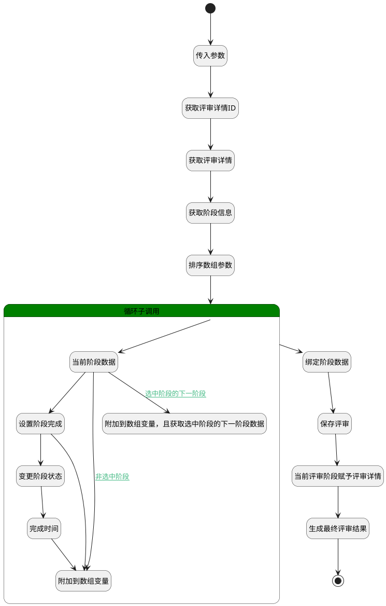

## 完成评审 <!-- {docsify-ignore-all} -->

   完成评审，判断是否为最终阶段，如果是变更评审的状态

### 处理过程




### 处理步骤说明

#### 开始 :id=Begin<sup class="footnote-symbol"> <font color=gray size=1>[开始]</font></sup>


*- N/A*
#### 结束 :id=END1<sup class="footnote-symbol"> <font color=gray size=1>[结束]</font></sup>


返回 `Default(传入变量)`

#### 传入参数 :id=DEBUGPARAM1<sup class="footnote-symbol"> <font color=gray size=1>[调试逻辑参数]</font></sup>


> [!NOTE|label:调试信息|icon:fa fa-bug]
> 调试输出参数`Default(传入变量)`的详细信息


#### 获取评审详情ID :id=PREPAREPARAM1<sup class="footnote-symbol"> <font color=gray size=1>[准备参数]</font></sup>


1. 将`Default(传入变量).principal_id(关联主体标识)` 设置给  `review_detail(评审详情).ID(标识)`

#### 获取评审详情 :id=DEACTION1<sup class="footnote-symbol"> <font color=gray size=1>[实体行为]</font></sup>


调用实体 [评审(REVIEW)](module/TestMgmt/review.md) 行为 [Get](module/TestMgmt/review#行为) ，行为参数为`review_detail(评审详情)`

#### 获取阶段信息 :id=PREPAREPARAM2<sup class="footnote-symbol"> <font color=gray size=1>[准备参数]</font></sup>


1. 将`review_detail(评审详情).STAGE(阶段)` 绑定给  `stage_list(阶段列表)`
2. 将`false` 设置给  `next_stage(下一阶段数据).is_next`
3. 将` ==> stage_list[ORDER]` 排序  `stage_list(阶段列表).ORDER(顺序)`
4. 将`stage_list(阶段列表).0` 绑定给  `end_stage(最终阶段)`

#### 排序数组参数 :id=SORTPARAM1<sup class="footnote-symbol"> <font color=gray size=1>[排序数组参数]</font></sup>


#### 循环子调用 :id=LOOPSUBCALL1<sup class="footnote-symbol"> <font color=gray size=1>[循环子调用]</font></sup>


循环参数`stage_list(阶段列表)`，子循环参数使用`for_stage(当前循环阶段)`
#### 绑定阶段数据 :id=PREPAREPARAM5<sup class="footnote-symbol"> <font color=gray size=1>[准备参数]</font></sup>


1. 将`stage_arr(阶段数据)` 设置给  `review_detail(评审详情).STAGE(阶段)`

#### 保存评审 :id=DEACTION2<sup class="footnote-symbol"> <font color=gray size=1>[实体行为]</font></sup>


调用实体 [评审(REVIEW)](module/TestMgmt/review.md) 行为 [Save](module/TestMgmt/review#行为) ，行为参数为`review_detail(评审详情)`

#### 当前评审阶段赋予评审详情 :id=PREPAREPARAM7<sup class="footnote-symbol"> <font color=gray size=1>[准备参数]</font></sup>


1. 将`Default(传入变量).curstage_id` 设置给  `review_detail(评审详情).curstage_id`

#### 生成最终评审结果 :id=DELOGIC1<sup class="footnote-symbol"> <font color=gray size=1>[实体逻辑]</font></sup>


调用实体 [评审内容(REVIEW_CONTENT)](module/TestMgmt/review_content.md) 处理逻辑 [生成最终评审结果]((module/TestMgmt/review_content/logic/generate_review_result_finally.md)) ，行为参数为`review_detail(评审详情)`

#### 当前阶段数据 :id=DEBUGPARAM2<sup class="footnote-symbol"> <font color=gray size=1>[调试逻辑参数]</font></sup>


> [!NOTE|label:调试信息|icon:fa fa-bug]
> 调试输出参数`for_stage(当前循环阶段)`的详细信息


#### 附加到数组变量，且获取选中阶段的下一阶段数据 :id=PREPAREPARAM8<sup class="footnote-symbol"> <font color=gray size=1>[准备参数]</font></sup>


1. 将`for_stage(当前循环阶段)` 追加到  `stage_arr(阶段数据)`
2. 将`false` 设置给  `next_stage(下一阶段数据).is_next`
3. 将`20` 设置给  `for_stage(当前循环阶段).STAGE_STATE(评审阶段状态)`

#### 设置阶段完成 :id=PREPAREPARAM3<sup class="footnote-symbol"> <font color=gray size=1>[准备参数]</font></sup>


1. 将`30` 设置给  `for_stage(当前循环阶段).STAGE_STATE(评审阶段状态)`
2. 将`true` 设置给  `next_stage(下一阶段数据).is_next`

#### 附加到数组变量 :id=PREPAREPARAM4<sup class="footnote-symbol"> <font color=gray size=1>[准备参数]</font></sup>


1. 将`for_stage(当前循环阶段)` 追加到  `stage_arr(阶段数据)`

#### 变更阶段状态 :id=PREPAREPARAM6<sup class="footnote-symbol"> <font color=gray size=1>[准备参数]</font></sup>


1. 将`60` 设置给  `review_detail(评审详情).STATE(评审状态)`

#### 完成时间 :id=RAWSFCODE1<sup class="footnote-symbol"> <font color=gray size=1>[直接后台代码]</font></sup>


<p class="panel-title"><b>执行代码[JavaScript]</b></p>

```javascript
var defaultObj = logic.getParam("review_detail");
defaultObj.set("COMPLETED_AT", new Date());
```


### 连接条件说明
#### 当前循环阶段为选中阶段 


#### 当前阶段为最后阶段 


#### 非选中阶段 :id=DEBUGPARAM2-PREPAREPARAM4

( AND `next_stage(下一阶段数据).is_next` EQ `false`)
#### 选中阶段的下一阶段 :id=DEBUGPARAM2-PREPAREPARAM8

`next_stage(下一阶段数据).is_next` EQ `true`


### 实体逻辑参数

|    中文名   |    代码名    |  数据类型    |  实体   |备注 |
| --------| --------| -------- | -------- | --------   |
|传入变量(<i class="fa fa-check"/></i>)|Default|数据对象|[评审内容(REVIEW_CONTENT)](module/TestMgmt/review_content.md)||
|最终阶段|end_stage|数据对象|[评审阶段(REVIEW_STAGE)](module/TestMgmt/review_stage.md)||
|当前循环阶段|for_stage|数据对象|[评审阶段(REVIEW_STAGE)](module/TestMgmt/review_stage.md)||
|下一阶段数据|next_stage|数据对象|[评审阶段(REVIEW_STAGE)](module/TestMgmt/review_stage.md)||
|评审详情|review_detail|数据对象|[评审(REVIEW)](module/TestMgmt/review.md)||
|阶段数据|stage_arr|数据对象列表|[评审阶段(REVIEW_STAGE)](module/TestMgmt/review_stage.md)||
|阶段列表|stage_list|数据对象列表|[评审阶段(REVIEW_STAGE)](module/TestMgmt/review_stage.md)||
