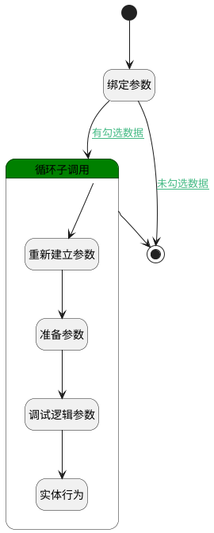

## 创建评审数据 <!-- {docsify-ignore-all} -->

   

### 处理过程




### 处理步骤说明

#### 开始 :id=Begin<sup class="footnote-symbol"> <font color=gray size=1>[开始]</font></sup>


*- N/A*
#### 绑定参数 :id=BINDPARAM1<sup class="footnote-symbol"> <font color=gray size=1>[绑定参数]</font></sup>


绑定参数`Default(传入变量)` 到 `selecteddata(需求列表)`
#### 循环子调用 :id=LOOPSUBCALL1<sup class="footnote-symbol"> <font color=gray size=1>[循环子调用]</font></sup>


循环参数`selecteddata(需求列表)`，子循环参数使用`for_temp_obj(循环临时变量)`
#### 重新建立参数 :id=RENEWPARAM1<sup class="footnote-symbol"> <font color=gray size=1>[重新建立参数]</font></sup>


重建参数```review_content_obj(关系对象)```
#### 准备参数 :id=PREPAREPARAM1<sup class="footnote-symbol"> <font color=gray size=1>[准备参数]</font></sup>


    无

#### 结束 :id=END1<sup class="footnote-symbol"> <font color=gray size=1>[结束]</font></sup>


*- N/A*

#### 调试逻辑参数 :id=DEBUGPARAM1<sup class="footnote-symbol"> <font color=gray size=1>[调试逻辑参数]</font></sup>


> [!NOTE|label:调试信息|icon:fa fa-bug]
> 调试输出参数`for_temp_obj(循环临时变量)`的详细信息


#### 实体行为 :id=DEACTION1<sup class="footnote-symbol"> <font color=gray size=1>[实体行为]</font></sup>


调用实体 [评审内容(REVIEW_CONTENT)](module/TestMgmt/review_content.md) 行为 [Create](module/TestMgmt/review_content#行为) ，行为参数为`review_content_obj(关系对象)`


### 连接条件说明
#### 未勾选数据 :id=BINDPARAM1-END1

`selecteddata(需求列表).size` EQ `0`
#### 有勾选数据 :id=BINDPARAM1-LOOPSUBCALL1

`selecteddata(需求列表).size` GT `0`


### 实体逻辑参数

|    中文名   |    代码名    |  数据类型    |  实体   |备注 |
| --------| --------| -------- | -------- | --------   |
|传入变量(<i class="fa fa-check"/></i>)|Default|数据对象|[评审内容(REVIEW_CONTENT)](module/TestMgmt/review_content.md)||
|循环临时变量|for_temp_obj|数据对象|||
|关系对象|review_content_obj|数据对象|[评审内容(REVIEW_CONTENT)](module/TestMgmt/review_content.md)||
|需求列表|selecteddata|数据对象列表|||
