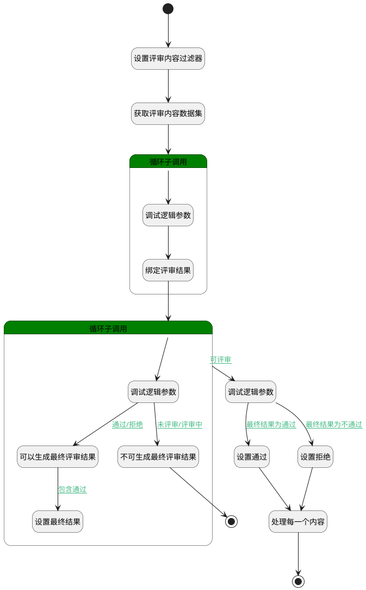

## 生成最终评审结果 <!-- {docsify-ignore-all} -->

   评审完成后生成最终的评审结果

### 处理过程

### 处理步骤说明

#### 设置通过 :id=PREPAREPARAM5 [准备参数]

1. 将`1` 设置给  `for_content(评审内容循环数据).FINAL_STAGE_RESULTS(最终评审结果)`

#### 开始 :id=Begin [开始]

*- N/A*
#### 结束 :id=END1 [结束]

返回 `Default(传入变量)`

#### 设置评审内容过滤器 :id=PREPAREPARAM7 [准备参数]

1. 将`Default(传入变量).ID(标识)` 设置给  `filter_content(评审内容过滤器).N_PRINCIPAL_ID_EQ`
2. 将`REVIEW` 设置给  `filter_content(评审内容过滤器).N_PRINCIPAL_TYPE_EQ`

#### 获取评审内容数据集 :id=DEDATASET1 [实体数据集]

调用实体 [评审内容(REVIEW_CONTENT)](module/TestMgmt/review_content.md) 数据集合 [全部数据(all)](module/TestMgmt/review_content#数据集合) ，查询参数为`filter_content(评审内容过滤器)`

将执行结果返回给参数`review_content_page(评审内容分页结果)`

#### 循环子调用 :id=LOOPSUBCALL2 [循环子调用]

循环参数`review_content_page(评审内容分页结果)`，子循环参数使用`for_content(评审内容循环数据)`
#### 调试逻辑参数 :id=DEBUGPARAM4 [调试逻辑参数]

> [!NOTE|label:调试信息|icon:fa fa-bug]
> 调试输出参数`for_content(评审内容循环数据)`的详细信息

#### 绑定评审结果 :id=PREPAREPARAM1 [准备参数]

1. 将`for_content(评审内容循环数据).STAGE_RESULTS(评审结果)` 绑定给  `stage_results(评审结果)`
2. 将`0` 设置给  `finally_result(最终结果).STAGE_RESULTS(评审结果)`
3. 将`false` 设置给  `finally_result(最终结果).FINAL_STAGE_RESULTS(最终评审结果)`

#### 循环子调用 :id=LOOPSUBCALL1 [循环子调用]

循环参数`stage_results(评审结果)`，子循环参数使用`cur_result(当前结果)`
#### 调试逻辑参数 :id=DEBUGPARAM3 [调试逻辑参数]

> [!NOTE|label:调试信息|icon:fa fa-bug]
> 调试输出参数`for_content(评审内容循环数据)`的详细信息

#### 处理每一个内容 :id=DEACTION1 [实体行为]

调用实体 [评审内容(REVIEW_CONTENT)](module/TestMgmt/review_content.md) 行为 [Update](module/TestMgmt/review_content#行为) ，行为参数为`for_content(评审内容循环数据)`

#### 调试逻辑参数 :id=DEBUGPARAM2 [调试逻辑参数]

> [!NOTE|label:调试信息|icon:fa fa-bug]
> 调试输出参数`cur_result(当前结果)`的详细信息

#### 设置拒绝 :id=PREPAREPARAM6 [准备参数]

1. 将`0` 设置给  `for_content(评审内容循环数据).FINAL_STAGE_RESULTS(最终评审结果)`

#### 跳出 :id=END2 [结束]

返回 `跳出循环（BREAK）`

#### 可以生成最终评审结果 :id=PREPAREPARAM2 [准备参数]

1. 将`true` 设置给  `finally_result(最终结果).FINAL_STAGE_RESULTS(最终评审结果)`

#### 不可生成最终评审结果 :id=PREPAREPARAM3 [准备参数]

1. 将`false` 设置给  `finally_result(最终结果).FINAL_STAGE_RESULTS(最终评审结果)`

#### 设置最终结果 :id=PREPAREPARAM4 [准备参数]

1. 将`1` 设置给  `finally_result(最终结果).STAGE_RESULTS(评审结果)`

### 连接条件说明
#### 通过/拒绝 :id=DEBUGPARAM2-PREPAREPARAM2

(`cur_result(当前结果).RESULT_STATE(状态)` EQ `3` OR `cur_result(当前结果).RESULT_STATE(状态)` EQ `4`)
#### 包含通过 :id=PREPAREPARAM2-PREPAREPARAM4

`cur_result(当前结果).RESULT_STATE(状态)` EQ `3`
#### 未评审/评审中 :id=DEBUGPARAM2-PREPAREPARAM3

(`cur_result(当前结果).RESULT_STATE(状态)` EQ `1` OR `cur_result(当前结果).RESULT_STATE(状态)` EQ `2`)
#### 可评审 :id=LOOPSUBCALL1-DEBUGPARAM3

`finally_result(最终结果).FINAL_STAGE_RESULTS(最终评审结果)` NOTEQ `false`
#### 最终结果为通过 :id=DEBUGPARAM3-PREPAREPARAM5

`finally_result(最终结果).STAGE_RESULTS(评审结果)` EQ `1`
#### 最终结果为不通过 :id=DEBUGPARAM3-PREPAREPARAM6

`finally_result(最终结果).STAGE_RESULTS(评审结果)` NOTEQ `1`

### 实体逻辑参数

|    中文名   |    代码名    |  数据类型    |  实体   |备注 |
| --------| --------| -------- | -------- | --------   |
|传入变量(<i class="fa fa-check"/></i>)|Default|数据对象|[评审内容(REVIEW_CONTENT)](module/TestMgmt/review_content.md)||
|当前结果|cur_result|数据对象|[评审结果(REVIEW_RESULT)](module/TestMgmt/review_result.md)||
|评审内容过滤器|filter_content|过滤器|||
|最终结果|finally_result|数据对象|[评审内容(REVIEW_CONTENT)](module/TestMgmt/review_content.md)||
|评审内容循环数据|for_content|数据对象|[评审内容(REVIEW_CONTENT)](module/TestMgmt/review_content.md)||
|评审内容分页结果|review_content_page|分页查询|||
|评审结果|stage_results|数据对象列表|[评审结果(REVIEW_RESULT)](module/TestMgmt/review_result.md)||
|测试用例详情|test_case|数据对象|[用例(TEST_CASE)](module/TestMgmt/test_case.md)||
