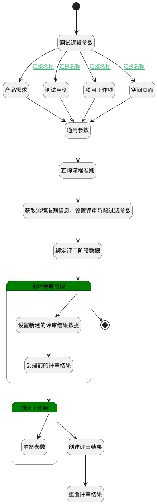

## 生成评审结果 <!-- {docsify-ignore-all} -->

   创建后自动生成评审结果

### 处理过程




### 处理步骤说明

#### 测试用例 :id=PREPAREPARAM6<sup class="footnote-symbol"> <font color=gray size=1>[准备参数]</font></sup>


1. 将`Default(传入变量).TEST_CASE(测试用例)` 绑定给  `test_case(测试用例)`
2. 将`test_case(测试用例).TEST_LIBRARY_ID(测试库)` 设置给  `guideline_filter(流程准则过滤器).N_SCOPE_ID_EQ`
3. 将`LIBRARY` 设置给  `guideline_filter(流程准则过滤器).N_OBJECT_TYPE_EQ`

#### 产品需求 :id=PREPAREPARAM5<sup class="footnote-symbol"> <font color=gray size=1>[准备参数]</font></sup>


1. 将`Default(传入变量).IDEA(产品需求)` 绑定给  `idea(产品需求)`
2. 将`idea(产品需求).PRODUCT_ID(产品)` 设置给  `guideline_filter(流程准则过滤器).N_SCOPE_ID_EQ`
3. 将`PRODUCT` 设置给  `guideline_filter(流程准则过滤器).N_OBJECT_TYPE_EQ`

#### 开始 :id=Begin<sup class="footnote-symbol"> <font color=gray size=1>[开始]</font></sup>


*- N/A*
#### 结束 :id=END1<sup class="footnote-symbol"> <font color=gray size=1>[结束]</font></sup>


*- N/A*

#### 调试逻辑参数 :id=DEBUGPARAM2<sup class="footnote-symbol"> <font color=gray size=1>[调试逻辑参数]</font></sup>


> [!NOTE|label:调试信息|icon:fa fa-bug]
> 调试输出参数`Default(传入变量)`的详细信息


#### 通用参数 :id=PREPAREPARAM1<sup class="footnote-symbol"> <font color=gray size=1>[准备参数]</font></sup>


1. 将`Default(传入变量).TARGET_TYPE(关联目标类型)` 设置给  `guideline_filter(流程准则过滤器).N_SUBJECT_TYPE_EQ`
2. 将`Default(传入变量).REVIEW_DATA(评审数据)` 绑定给  `review`

#### 查询流程准则 :id=DEDATASET1<sup class="footnote-symbol"> <font color=gray size=1>[实体数据集]</font></sup>


调用实体 [流程准则(GUIDELINE)](module/TestMgmt/guideline.md) 数据集合 [数据集(DEFAULT)](module/TestMgmt/guideline#数据集合) ，查询参数为`guideline_filter(流程准则过滤器)`

将执行结果返回给参数`guideline_pages(流程准则分页查询结果)`

#### 获取流程准则信息，设置评审阶段过滤参数 :id=PREPAREPARAM2<sup class="footnote-symbol"> <font color=gray size=1>[准备参数]</font></sup>


1. 将`guideline_pages(流程准则分页查询结果).0` 绑定给  `guideline(流程准则)`
2. 将`guideline(流程准则).ID(标识)` 设置给  `review_stage_filter(过滤器).N_GUIDELINE_ID_EQ`

#### 绑定评审阶段数据 :id=PREPAREPARAM4<sup class="footnote-symbol"> <font color=gray size=1>[准备参数]</font></sup>


1. 将`guideline(流程准则).review_stage(评审阶段)` 绑定给  `review_stage_list(评审阶段对象列表)`
2. 将`review.STAGE(阶段)` 绑定给  `reviewer_list`

#### 循环评审阶段 :id=LOOPSUBCALL1<sup class="footnote-symbol"> <font color=gray size=1>[循环子调用]</font></sup>


循环参数`review_stage_list(评审阶段对象列表)`，子循环参数使用`review_stage(评审阶段)`
#### 项目工作项 :id=PREPAREPARAM8<sup class="footnote-symbol"> <font color=gray size=1>[准备参数]</font></sup>


1. 将`Default(传入变量).WORK_ITEM(项目工作项)` 绑定给  `work_item(工作项)`
2. 将`work_item(工作项).PROJECT_ID(项目)` 设置给  `guideline_filter(流程准则过滤器).N_SCOPE_ID_EQ`
3. 将`PROJECT` 设置给  `guideline_filter(流程准则过滤器).N_OBJECT_TYPE_EQ`

#### 设置新建的评审结果数据 :id=PREPAREPARAM3<sup class="footnote-symbol"> <font color=gray size=1>[准备参数]</font></sup>


1. 将`Default(传入变量).ID(标识)` 设置给  `review_result(评审结果).CONTENT_ID(评审内容标识)`
2. 将`review_stage(评审阶段).ORDER(顺序)` 设置给  `review_result(评审结果).SEQUENCES(顺序)`
3. 将`review_stage(评审阶段).NAME(名称)` 设置给  `review_result(评审结果).NAME(名称)`
4. 将`review_stage(评审阶段).ID(标识)` 设置给  `review_result(评审结果).STAGE_ID(阶段标识)`
5. 将`guideline(流程准则).ID(标识)` 设置给  `review_result(评审结果).GUIDELINE_ID`

#### 空间页面 :id=PREPAREPARAM9<sup class="footnote-symbol"> <font color=gray size=1>[准备参数]</font></sup>


1. 将`Default(传入变量).PAGE(空间页面)` 绑定给  `page(页面)`
2. 将`page(页面).SPACE_ID(空间标识)` 设置给  `guideline_filter(流程准则过滤器).N_SCOPE_ID_EQ`
3. 将`SPACE` 设置给  `guideline_filter(流程准则过滤器).N_OBJECT_TYPE_EQ`

#### 创建前的评审结果 :id=DEBUGPARAM3<sup class="footnote-symbol"> <font color=gray size=1>[调试逻辑参数]</font></sup>


> [!NOTE|label:调试信息|icon:fa fa-bug]
> 调试输出参数`review_result(评审结果)`的详细信息


#### 准备参数 :id=PREPAREPARAM7<sup class="footnote-symbol"> <font color=gray size=1>[准备参数]</font></sup>


1. 将`reviewer_temp.reviewer` 设置给  `review_result(评审结果).REVIEWER(评审人)`

#### 循环子调用 :id=LOOPSUBCALL2<sup class="footnote-symbol"> <font color=gray size=1>[循环子调用]</font></sup>


循环参数`reviewer_list`，子循环参数使用`reviewer_temp`
#### 创建评审结果 :id=DEACTION1<sup class="footnote-symbol"> <font color=gray size=1>[实体行为]</font></sup>


调用实体 [评审结果(REVIEW_RESULT)](module/TestMgmt/review_result.md) 行为 [Create](module/TestMgmt/review_result#行为) ，行为参数为`review_result(评审结果)`

#### 重置评审结果 :id=RENEWPARAM1<sup class="footnote-symbol"> <font color=gray size=1>[重新建立参数]</font></sup>


重建参数```review_result(评审结果)```

### 连接条件说明
#### 连接名称 :id=DEBUGPARAM2-PREPAREPARAM6

`Default(传入变量).target_type(关联目标类型)` EQ `TEST_CASE`
#### 连接名称 


#### 连接名称 :id=DEBUGPARAM2-PREPAREPARAM5

`Default(传入变量).target_type(关联目标类型)` EQ `IDEA`
#### 连接名称 :id=DEBUGPARAM2-PREPAREPARAM8

`Default(传入变量).target_type(关联目标类型)` EQ `WORK_ITEM`
#### 连接名称 :id=DEBUGPARAM2-PREPAREPARAM9

`Default(传入变量).target_type(关联目标类型)` EQ `PAGE`


### 实体逻辑参数

|    中文名   |    代码名    |  数据类型    |  实体   |备注 |
| --------| --------| -------- | -------- | --------   |
|传入变量(<i class="fa fa-check"/></i>)|Default|数据对象|[评审内容(REVIEW_CONTENT)](module/TestMgmt/review_content.md)||
|流程准则|guideline|数据对象|[流程准则(GUIDELINE)](module/TestMgmt/guideline.md)||
|流程准则过滤器|guideline_filter|过滤器|||
|流程准则分页查询结果|guideline_pages|分页查询|||
|产品需求|idea|数据对象|[需求(IDEA)](module/ProdMgmt/idea.md)||
|页面|page|数据对象|[页面(PAGE)](module/Wiki/article_page.md)||
|review|review|数据对象|[评审(REVIEW)](module/TestMgmt/review.md)||
|评审结果|review_result|数据对象|[评审结果(REVIEW_RESULT)](module/TestMgmt/review_result.md)||
|评审阶段|review_stage|数据对象|[评审阶段(REVIEW_STAGE)](module/TestMgmt/review_stage.md)||
|过滤器|review_stage_filter|过滤器|||
|评审阶段对象列表|review_stage_list|数据对象列表|[评审阶段(REVIEW_STAGE)](module/TestMgmt/review_stage.md)||
|reviewer_list|reviewer_list|数据对象列表|||
|reviewer_temp|reviewer_temp|数据对象|||
|测试用例|test_case|数据对象|[用例(TEST_CASE)](module/TestMgmt/test_case.md)||
|工作项|work_item|数据对象|[工作项(WORK_ITEM)](module/ProjMgmt/work_item.md)||
