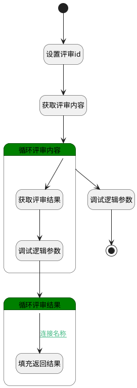

## 获取评审结果列表 <!-- {docsify-ignore-all} -->

   根据评审id和阶段id，获取评审数据列表
需要给default传入评审id（review_id）和阶段id（stage_id）

### 处理过程

### 处理步骤说明

#### 开始 :id=Begin [开始]

*- N/A*
#### 结束 :id=END1 [结束]

返回 `return_context(返回的评审内容)`

#### 设置评审id :id=PREPAREPARAM1 [准备参数]

1. 将`Default(传入变量).review_id` 设置给  `filter(过滤器).N_PRINCIPAL_ID_EQ`

#### 获取评审内容 :id=DEDATASET1 [实体数据集]

调用实体 [评审内容(REVIEW_CONTENT)](module/TestMgmt/review_content.md) 数据集合 [全部数据(all)](module/TestMgmt/review_content#数据集合) ，查询参数为`filter(过滤器)`

将执行结果返回给参数`review_contexts(评审内容)`

#### 循环评审内容 :id=LOOPSUBCALL1 [循环子调用]

循环参数`review_contexts(评审内容)`，子循环参数使用`for_obj(循环变量)`
#### 调试逻辑参数 :id=DEBUGPARAM2 [调试逻辑参数]

> [!NOTE|label:调试信息|icon:fa fa-bug]
> 调试输出参数`return_context(返回的评审内容)`的详细信息

#### 获取评审结果 :id=PREPAREPARAM2 [准备参数]

1. 将`for_obj(循环变量).STAGE_RESULTS(评审结果)` 绑定给  `result_list(评审结果列表)`
2. 将`Default(传入变量).stage_id` 设置给  `result_filter(评审结果过滤器).N_STAGE_ID_EQ`

#### 调试逻辑参数 :id=DEBUGPARAM1 [调试逻辑参数]

> [!NOTE|label:调试信息|icon:fa fa-bug]
> 调试输出参数`result_list(评审结果列表)`的详细信息

#### 循环评审结果 :id=LOOPSUBCALL2 [循环子调用]

循环参数`result_list(评审结果列表)`，子循环参数使用`result_obj(评审结果循环变量)`
#### 填充返回结果 :id=APPENDPARAM1 [附加到数组参数]

将参数`result_obj(评审结果循环变量)` 添加到数组参数`return_context(返回的评审内容)`

### 连接条件说明
#### 连接名称 :id=LOOPSUBCALL2-APPENDPARAM1

`result_obj(评审结果循环变量).RESULT_STATE(状态)` EQ `1`

### 实体逻辑参数

|    中文名   |    代码名    |  数据类型    |  实体   |备注 |
| --------| --------| -------- | -------- | --------   |
|传入变量(<i class="fa fa-check"/></i>)|Default|数据对象|[评审内容(REVIEW_CONTENT)](module/TestMgmt/review_content.md)||
|过滤器|filter|过滤器|||
|循环变量|for_obj|数据对象|[评审内容(REVIEW_CONTENT)](module/TestMgmt/review_content.md)||
|评审结果过滤器|result_filter|过滤器|||
|评审结果列表|result_list|分页查询|||
|评审结果循环变量|result_obj|数据对象|[评审结果(REVIEW_RESULT)](module/TestMgmt/review_result.md)||
|返回的评审内容|return_context|数据对象列表|[评审内容(REVIEW_CONTENT)](module/TestMgmt/review_content.md)||
|评审内容|review_contexts|分页查询|||
