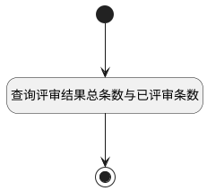

## 评审结果条数 <!-- {docsify-ignore-all} -->

   查询评审结果总条数与已评审条数

### 处理过程




### 处理步骤说明

#### 开始 :id=Begin<sup class="footnote-symbol"> <font color=gray size=1>[开始]</font></sup>


*- N/A*
#### 结束 :id=END1<sup class="footnote-symbol"> <font color=gray size=1>[结束]</font></sup>


返回 `result(结果)`

#### 查询评审结果总条数与已评审条数 :id=RAWSQLCALL1<sup class="footnote-symbol"> <font color=gray size=1>[直接SQL调用]</font></sup>


<p class="panel-title"><b>执行sql语句</b></p>

```sql
SELECT
    query1.count1 AS total,
    query2.count2 AS total_already,
    (CONVERT(query2.count2, DECIMAL) / query1.count1 * 100) AS schedule
FROM
    (SELECT COUNT(1) AS count1
     FROM review rv
              LEFT JOIN relation re ON re.PRINCIPAL_ID = rv.ID AND re.PRINCIPAL_TYPE = 'REVIEW'
     WHERE rv.ID = ?) AS query1,

    (SELECT COUNT(*) AS count2
     FROM review rv
              INNER JOIN relation re ON re.PRINCIPAL_ID = rv.ID AND re.PRINCIPAL_TYPE = 'REVIEW'
              INNER JOIN review_content_extend rc ON re.ID = rc.ID AND rc.review_result = 'pass'
     WHERE rv.ID = ?) AS query2;
```

<p class="panel-title"><b>执行sql参数</b></p>

1. `Default(传入变量).ID(标识)`
2. `Default(传入变量).ID(标识)`

重置参数`result(结果)`，并将执行sql结果赋值给参数`result(结果)`


### 实体逻辑参数

|    中文名   |    代码名    |  数据类型    |  实体   |备注 |
| --------| --------| -------- | -------- | --------   |
|传入变量(<i class="fa fa-check"/></i>)|Default|数据对象|[评审内容(REVIEW_CONTENT)](module/TestMgmt/review_content.md)||
|结果|result|数据对象|||
