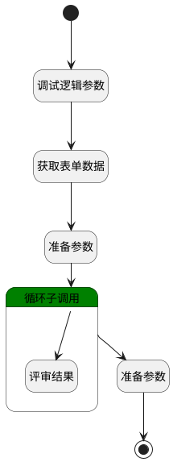

## 设置评审结果 <!-- {docsify-ignore-all} -->

   待删除

### 处理过程

### 处理步骤说明

#### 开始 :id=Begin [开始]

*- N/A*
#### 调试逻辑参数 :id=DEBUGPARAM1 [调试逻辑参数]

> [!NOTE|label:调试信息|icon:fa fa-bug]
> 调试输出参数`Default(传入变量)`的详细信息

#### 获取表单数据 :id=BINDPARAM1 [绑定参数]

绑定参数`Default(传入变量)` 到 `srfactionparam`
#### 准备参数 :id=PREPAREPARAM2 [准备参数]

1. 将`Default(传入变量).stage_results(评审结果)` 绑定给  `review_result_list(评审结果列表)`

#### 结束 :id=END1 [结束]

*- N/A*

#### 循环子调用 :id=LOOPSUBCALL1 [循环子调用]

循环参数`review_result_list(评审结果列表)`，子循环参数使用`review_result(评审结果)`
#### 准备参数 :id=PREPAREPARAM1 [准备参数]

1. 将`srfactionparam.0` 绑定给  `form_date(表单数据)`
2. 将`review_result(评审结果).result_info` 设置给  `result(评审结果).COMMENT`
3. 将`review_result(评审结果).id(标识)` 设置给  `result(评审结果).CONTENT_ID`

#### 评审结果 :id=DEBUGPARAM3 [调试逻辑参数]

> [!NOTE|label:调试信息|icon:fa fa-bug]
> 调试输出参数`review_result(评审结果)`的详细信息

### 实体逻辑参数

|    中文名   |    代码名    |  数据类型    |  实体   |备注 |
| --------| --------| -------- | -------- | --------   |
|传入变量(<i class="fa fa-check"/></i>)|Default|数据对象|[评审内容(REVIEW_CONTENT)](module/TestMgmt/review_content.md)||
|表单数据|form_date|数据对象|||
|评审结果|result|数据对象|||
|评审结果|review_result|数据对象|[评审结果(REVIEW_RESULT)](module/TestMgmt/review_result.md)||
|评审结果列表|review_result_list|数据对象列表|[评审结果(REVIEW_RESULT)](module/TestMgmt/review_result.md)||
|srfactionparam|srfactionparam|数据对象列表|||
