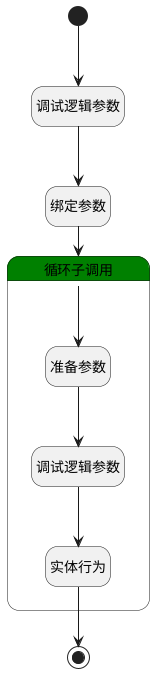

## 设置评审结果 <!-- {docsify-ignore-all} -->

   测试

### 处理过程

### 处理步骤说明

#### 开始 :id=Begin [开始]

*- N/A*
#### 调试逻辑参数 :id=DEBUGPARAM1 [调试逻辑参数]

> [!NOTE|label:调试信息|icon:fa fa-bug]
> 调试输出参数`Default(传入变量)`的详细信息

#### 绑定参数 :id=BINDPARAM1 [绑定参数]

绑定参数`Default(传入变量)` 到 `srfactionparam`
#### 循环子调用 :id=LOOPSUBCALL1 [循环子调用]

循环参数`srfactionparam`，子循环参数使用`for_obj(循环临时变量)`
#### 结束 :id=END1 [结束]

*- N/A*

#### 准备参数 :id=PREPAREPARAM1 [准备参数]

1. 将`for_obj(循环临时变量).result_info` 设置给  `result(评审结果).COMMENT`
2. 将`for_obj(循环临时变量).id` 设置给  `result(评审结果).CONTENT_ID`

#### 调试逻辑参数 :id=DEBUGPARAM2 [调试逻辑参数]

> [!NOTE|label:调试信息|icon:fa fa-bug]
> 调试输出参数`result(评审结果)`的详细信息

#### 实体行为 :id=DEACTION1 [实体行为]

调用实体 [评审结果(REVIEW_RESULT)](module/TestMgmt/review_result.md) 行为 [Create](module/TestMgmt/review_result#行为) ，行为参数为`result(评审结果)`

### 实体逻辑参数

|    中文名   |    代码名    |  数据类型    |  实体   |备注 |
| --------| --------| -------- | -------- | --------   |
|传入变量(<i class="fa fa-check"/></i>)|Default|数据对象|[评审内容(REVIEW_CONTENT)](module/TestMgmt/review_content.md)||
|循环临时变量|for_obj|数据对象|||
|评审结果|result|数据对象|||
|srfactionparam|srfactionparam|数据对象列表|||
