## 设置评审结果（批） <!-- {docsify-ignore-all} -->

   测试

### 处理过程

```plantuml
@startuml
hide empty description
<style>
root {
  HyperlinkColor #42b983
}
</style>

hide empty description
state "开始" as Begin <<start>> [[$./set_review_result_all#begin {"开始"}]]
state "根据评审ID获取评审数据" as DEACTION3  [[$./set_review_result_all#deaction3 {"根据评审ID获取评审数据"}]]
state "获取传入对象" as DEBUGPARAM1  [[$./set_review_result_all#debugparam1 {"获取传入对象"}]]
state "获取当前阶段数据" as PREPAREPARAM4  [[$./set_review_result_all#prepareparam4 {"获取当前阶段数据"}]]
state "获取评审ID" as PREPAREPARAM5  [[$./set_review_result_all#prepareparam5 {"获取评审ID"}]]
state "循环阶段" as LOOPSUBCALL2  [[$./set_review_result_all#loopsubcall2 {"循环阶段"}]] #green {
state "输出阶段" as DEBUGPARAM3  [[$./set_review_result_all#debugparam3 {"输出阶段"}]]
state "设置评审内容ID" as PREPAREPARAM1  [[$./set_review_result_all#prepareparam1 {"设置评审内容ID"}]]
state "获取评审内容" as DEACTION1  [[$./set_review_result_all#deaction1 {"获取评审内容"}]]
state "获取评审结果" as PREPAREPARAM2  [[$./set_review_result_all#prepareparam2 {"获取评审结果"}]]
state "调试逻辑参数" as DEBUGPARAM4  [[$./set_review_result_all#debugparam4 {"调试逻辑参数"}]]
}
state "循环结果" as LOOPSUBCALL1  [[$./set_review_result_all#loopsubcall1 {"循环结果"}]] #green {
state "输出结果" as DEBUGPARAM2  [[$./set_review_result_all#debugparam2 {"输出结果"}]]
state "设置结果" as PREPAREPARAM3  [[$./set_review_result_all#prepareparam3 {"设置结果"}]]
state "更新结果" as DEACTION2  [[$./set_review_result_all#deaction2 {"更新结果"}]]
}


Begin --> DEBUGPARAM1
DEBUGPARAM1 --> PREPAREPARAM5
PREPAREPARAM5 --> DEACTION3
DEACTION3 --> PREPAREPARAM4
PREPAREPARAM4 --> LOOPSUBCALL2
LOOPSUBCALL2 --> DEBUGPARAM3
DEBUGPARAM3 --> PREPAREPARAM1 : [[$./set_review_result_all#debugparam3-prepareparam1{连接名称} 连接名称]]
PREPAREPARAM1 --> DEACTION1
DEACTION1 --> PREPAREPARAM2
PREPAREPARAM2 --> DEBUGPARAM4
DEBUGPARAM4 --> LOOPSUBCALL1
LOOPSUBCALL1 --> DEBUGPARAM2
DEBUGPARAM2 --> PREPAREPARAM3
PREPAREPARAM3 --> DEACTION2


@enduml
```

### 处理步骤说明

#### 开始 :id=Begin [开始]

*- N/A*
#### 获取传入对象 :id=DEBUGPARAM1 [调试逻辑参数]

> [!NOTE|label:调试信息|icon:fa fa-bug]
> 调试输出参数`Default(传入变量)`的详细信息

#### 获取评审ID :id=PREPAREPARAM5 [准备参数]

1. 将`Default(传入变量).PRINCIPAL_ID(关联主体标识)` 设置给  `review(评审对象).ID(标识)`

#### 根据评审ID获取评审数据 :id=DEACTION3 [实体行为]

调用实体 [评审(REVIEW)](module/TestMgmt/review.md) 行为 [Get](module/TestMgmt/review#行为) ，行为参数为`review(评审对象)`

#### 获取当前阶段数据 :id=PREPAREPARAM4 [准备参数]

1. 将`review(评审对象).STAGE(阶段)` 绑定给  `review_stages(评审阶段)`

#### 循环阶段 :id=LOOPSUBCALL2 [循环子调用]

循环参数`review_stages(评审阶段)`，子循环参数使用`stage(阶段)`
#### 获取评审结果 :id=PREPAREPARAM2 [准备参数]

1. 将`review_content(评审内容).stage_results(评审结果)` 绑定给  `stage_results(阶段结果)`

#### 调试逻辑参数 :id=DEBUGPARAM4 [调试逻辑参数]

> [!NOTE|label:调试信息|icon:fa fa-bug]
> 调试输出参数`stage(阶段)`的详细信息

#### 输出阶段 :id=DEBUGPARAM3 [调试逻辑参数]

> [!NOTE|label:调试信息|icon:fa fa-bug]
> 调试输出参数`stage(阶段)`的详细信息

#### 设置评审内容ID :id=PREPAREPARAM1 [准备参数]

1. 将`Default(传入变量).ID(标识)` 设置给  `review_content(评审内容).ID(标识)`

#### 获取评审内容 :id=DEACTION1 [实体行为]

调用实体 [评审内容(REVIEW_CONTENT)](module/TestMgmt/review_content.md) 行为 [Get](module/TestMgmt/review_content#行为) ，行为参数为`review_content(评审内容)`

#### 循环结果 :id=LOOPSUBCALL1 [循环子调用]

循环参数`stage_results(阶段结果)`，子循环参数使用`for_result(子结果)`
#### 输出结果 :id=DEBUGPARAM2 [调试逻辑参数]

> [!NOTE|label:调试信息|icon:fa fa-bug]
> 调试输出参数`for_result(子结果)`的详细信息

#### 设置结果 :id=PREPAREPARAM3 [准备参数]

1. 将`3` 设置给  `for_result(子结果).RESULT_STATE(状态)`

#### 更新结果 :id=DEACTION2 [实体行为]

调用实体 [评审结果(REVIEW_RESULT)](module/TestMgmt/review_result.md) 行为 [Update](module/TestMgmt/review_result#行为) ，行为参数为`for_result(子结果)`

### 连接条件说明
#### 连接名称 :id=DEBUGPARAM3-PREPAREPARAM1

`stage(阶段).STAGE_STATE(评审阶段状态)` EQ `20`
#### 连接名称 

### 实体逻辑参数

|    中文名   |    代码名    |  数据类型    |  实体   |备注 |
| --------| --------| -------- | -------- | --------   |
|传入变量(<i class="fa fa-check"/></i>)|Default|数据对象|[评审内容(REVIEW_CONTENT)](module/TestMgmt/review_content.md)||
|子结果|for_result|数据对象|[评审结果(REVIEW_RESULT)](module/TestMgmt/review_result.md)||
|评审对象|review|数据对象|[评审(REVIEW)](module/TestMgmt/review.md)||
|评审内容|review_content|数据对象|[评审内容(REVIEW_CONTENT)](module/TestMgmt/review_content.md)||
|评审阶段|review_stages|数据对象列表|[评审阶段(REVIEW_STAGE)](module/TestMgmt/review_stage.md)||
|阶段|stage|数据对象|[评审阶段(REVIEW_STAGE)](module/TestMgmt/review_stage.md)||
|阶段结果|stage_results|数据对象列表|[评审阶段(REVIEW_STAGE)](module/TestMgmt/review_stage.md)||
