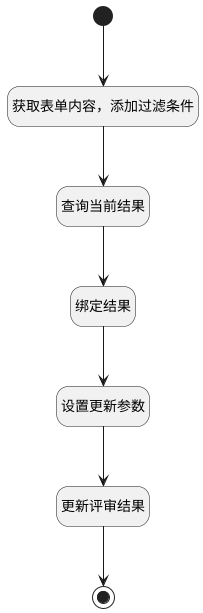

## 设置评审结果（批） <!-- {docsify-ignore-all} -->

   批量进行评审

### 处理过程

### 处理步骤说明

#### 开始 :id=Begin [开始]

*- N/A*
#### 获取表单内容，添加过滤条件 :id=PREPAREPARAM1 [准备参数]

1. 将`Default(传入变量).srfactionparam` 绑定给  `srfactionparam`
2. 将`srfactionparam.0` 绑定给  `form_data(表单数据)`
3. 将`Default(传入变量).ID(标识)` 设置给  `result_filter(评审结果过滤器).N_CONTENT_ID_EQ`
4. 将`form_data(表单数据).cur_stage_id` 设置给  `result_filter(评审结果过滤器).N_STAGE_ID_EQ`

#### 查询当前结果 :id=DEDATASET1 [实体数据集]

调用实体 [评审结果(REVIEW_RESULT)](module/TestMgmt/review_result.md) 数据集合 [数据集(DEFAULT)](module/TestMgmt/review_result#数据集合) ，查询参数为`result_filter(评审结果过滤器)`

将执行结果返回给参数`stage_results(阶段结果)`

#### 结束 :id=END1 [结束]

*- N/A*

#### 绑定结果 :id=BINDPARAM1 [绑定参数]

绑定参数`stage_results(阶段结果)` 到 `review_result(结果)`
#### 设置更新参数 :id=PREPAREPARAM2 [准备参数]

1. 将`form_data(表单数据).comment` 设置给  `review_result(结果).COMMENT(评审意见)`
2. 将`form_data(表单数据).result_state` 设置给  `review_result(结果).RESULT_STATE(状态)`

#### 更新评审结果 :id=DEACTION1 [实体行为]

调用实体 [评审结果(REVIEW_RESULT)](module/TestMgmt/review_result.md) 行为 [Update](module/TestMgmt/review_result#行为) ，行为参数为`review_result(结果)`

### 实体逻辑参数

|    中文名   |    代码名    |  数据类型    |  实体   |备注 |
| --------| --------| -------- | -------- | --------   |
|传入变量(<i class="fa fa-check"/></i>)|Default|数据对象|[评审内容(REVIEW_CONTENT)](module/TestMgmt/review_content.md)||
|表单数据|form_data|数据对象|||
|评审结果过滤器|result_filter|过滤器|||
|评审内容|review_content|数据对象|[评审内容(REVIEW_CONTENT)](module/TestMgmt/review_content.md)||
|结果|review_result|数据对象|[评审结果(REVIEW_RESULT)](module/TestMgmt/review_result.md)||
|srfactionparam|srfactionparam|数据对象列表|||
|阶段结果|stage_results|分页查询|||
