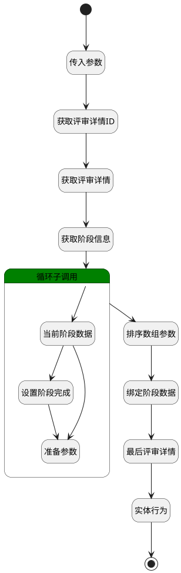

## 开始评审 <!-- {docsify-ignore-all} -->

   开启当前阶段评审

### 处理过程

### 处理步骤说明

#### 开始 :id=Begin [开始]

*- N/A*
#### 结束 :id=END1 [结束]

返回 `Default(传入变量)`

#### 传入参数 :id=DEBUGPARAM1 [调试逻辑参数]

> [!NOTE|label:调试信息|icon:fa fa-bug]
> 调试输出参数`Default(传入变量)`的详细信息

#### 获取评审详情ID :id=PREPAREPARAM1 [准备参数]

1. 将`Default(传入变量).principal_id(关联主体标识)` 设置给  `review_detail(评审详情).ID(标识)`

#### 获取评审详情 :id=DEACTION1 [实体行为]

调用实体 [评审(REVIEW)](module/TestMgmt/review.md) 行为 [Get](module/TestMgmt/review#行为) ，行为参数为`review_detail(评审详情)`

#### 获取阶段信息 :id=PREPAREPARAM2 [准备参数]

1. 将`review_detail(评审详情).STAGE(阶段)` 绑定给  `stage_list(阶段列表)`

#### 循环子调用 :id=LOOPSUBCALL1 [循环子调用]

循环参数`stage_list(阶段列表)`，子循环参数使用`for_stage(当前循环阶段)`
#### 排序数组参数 :id=SORTPARAM1 [排序数组参数]

#### 绑定阶段数据 :id=PREPAREPARAM5 [准备参数]

1. 将`stage_arr(阶段数据)` 设置给  `review_detail(评审详情).STAGE(阶段)`

#### 最后评审详情 :id=DEBUGPARAM3 [调试逻辑参数]

> [!NOTE|label:调试信息|icon:fa fa-bug]
> 调试输出参数`review_detail(评审详情)`的详细信息

#### 实体行为 :id=DEACTION2 [实体行为]

调用实体 [评审(REVIEW)](module/TestMgmt/review.md) 行为 [Save](module/TestMgmt/review#行为) ，行为参数为`review_detail(评审详情)`

#### 当前阶段数据 :id=DEBUGPARAM2 [调试逻辑参数]

> [!NOTE|label:调试信息|icon:fa fa-bug]
> 调试输出参数`for_stage(当前循环阶段)`的详细信息

#### 设置阶段完成 :id=PREPAREPARAM3 [准备参数]

1. 将`20` 设置给  `for_stage(当前循环阶段).STAGE_STATE(评审阶段状态)`

#### 准备参数 :id=PREPAREPARAM4 [准备参数]

1. 将`for_stage(当前循环阶段)` 追加到  `stage_arr(阶段数据)`

### 连接条件说明
#### 当前循环阶段为选中阶段 

#### 非选中阶段 

### 实体逻辑参数

|    中文名   |    代码名    |  数据类型    |  实体   |备注 |
| --------| --------| -------- | -------- | --------   |
|传入变量(<i class="fa fa-check"/></i>)|Default|数据对象|[评审内容(REVIEW_CONTENT)](module/TestMgmt/review_content.md)||
|最终阶段|end_stage|数据对象|[评审阶段(REVIEW_STAGE)](module/TestMgmt/review_stage.md)||
|当前循环阶段|for_stage|数据对象|[评审阶段(REVIEW_STAGE)](module/TestMgmt/review_stage.md)||
|评审详情|review_detail|数据对象|[评审(REVIEW)](module/TestMgmt/review.md)||
|阶段数据|stage_arr|数据对象列表|[评审阶段(REVIEW_STAGE)](module/TestMgmt/review_stage.md)||
|阶段列表|stage_list|数据对象列表|[评审阶段(REVIEW_STAGE)](module/TestMgmt/review_stage.md)||
