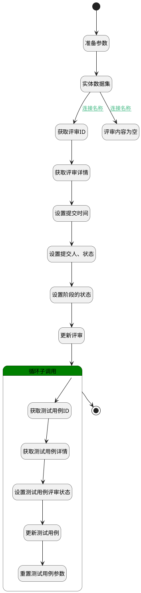

## 提交评审 <!-- {docsify-ignore-all} -->

   测试

### 处理过程




### 处理步骤说明

#### 开始 :id=Begin<sup class="footnote-symbol"> <font color=gray size=1>[开始]</font></sup>


*- N/A*
#### 获取评审详情 :id=DEACTION4<sup class="footnote-symbol"> <font color=gray size=1>[实体行为]</font></sup>


调用实体 [评审(REVIEW)](module/TestMgmt/review.md) 行为 [Get](module/TestMgmt/review#行为) ，行为参数为`review_detail(评审详情)`

#### 设置提交时间 :id=RAWSFCODE1<sup class="footnote-symbol"> <font color=gray size=1>[直接后台代码]</font></sup>


<p class="panel-title"><b>执行代码[JavaScript]</b></p>

```javascript
var review_detail = logic.getParam("review_detail");
review_detail.set("submitted_at", new Date());
```

#### 设置提交人、状态 :id=PREPAREPARAM1<sup class="footnote-symbol"> <font color=gray size=1>[准备参数]</font></sup>


1. 将`用户全局对象.srfpersonname` 设置给  `review_detail(评审详情).SUBMITTER_NAME(提交人)`
2. 将`用户全局对象.srfpersonid` 设置给  `review_detail(评审详情).SUBMITTER_ID(提交人标识)`
3. 将`20` 设置给  `review_detail(评审详情).STATE(评审状态)`

#### 设置阶段的状态 :id=PREPAREPARAM2<sup class="footnote-symbol"> <font color=gray size=1>[准备参数]</font></sup>

设置第一个阶段的状态为进行中

1. 将`review_detail(评审详情).STAGE(阶段)` 绑定给  `stages(评审阶段)`
2. 将`stages(评审阶段).0` 绑定给  `stage(阶段)`
3. 将`20` 设置给  `stage(阶段).STAGE_STATE(评审阶段状态)`

#### 准备参数 :id=PREPAREPARAM3<sup class="footnote-symbol"> <font color=gray size=1>[准备参数]</font></sup>


1. 将`Default(传入变量).PRINCIPAL_ID(关联主体标识)` 设置给  `reltion_filter(relation过滤器).N_PRINCIPAL_ID_EQ`
2. 将`REVIEW` 设置给  `reltion_filter(relation过滤器).N_PRINCIPAL_TYPE_EQ`

#### 实体数据集 :id=DEDATASET1<sup class="footnote-symbol"> <font color=gray size=1>[实体数据集]</font></sup>


调用实体 [关联(RELATION)](module/Base/relation.md) 数据集合 [数据集(DEFAULT)](module/Base/relation#数据集合) ，查询参数为`reltion_filter(relation过滤器)`

将执行结果返回给参数`relation_page(relation分页数据)`

#### 获取评审ID :id=PREPAREPARAM6<sup class="footnote-symbol"> <font color=gray size=1>[准备参数]</font></sup>


1. 将`Default(传入变量).PRINCIPAL_ID(关联主体标识)` 设置给  `review_detail(评审详情).ID(标识)`

#### 更新评审 :id=DEACTION1<sup class="footnote-symbol"> <font color=gray size=1>[实体行为]</font></sup>


调用实体 [评审(REVIEW)](module/TestMgmt/review.md) 行为 [Update](module/TestMgmt/review#行为) ，行为参数为`review_detail(评审详情)`

#### 结束 :id=END1<sup class="footnote-symbol"> <font color=gray size=1>[结束]</font></sup>


返回 `Default(传入变量)`

#### 循环子调用 :id=LOOPSUBCALL1<sup class="footnote-symbol"> <font color=gray size=1>[循环子调用]</font></sup>


循环参数`relation_page(relation分页数据)`，子循环参数使用`for_reltion(循环中的关联对象)`
#### 评审内容为空 :id=THROWEXCEPTION1<sup class="footnote-symbol"> <font color=gray size=1>[抛出异常]</font></sup>


> [!ATTENTION|label:抛出异常|icon:fa fa-warning]
> 错误信息：请添加评审内容

#### 获取测试用例ID :id=PREPAREPARAM4<sup class="footnote-symbol"> <font color=gray size=1>[准备参数]</font></sup>


1. 将`for_reltion(循环中的关联对象).TARGET_ID(关联目标标识)` 设置给  `test_case(测试用例).ID(标识)`

#### 获取测试用例详情 :id=DEACTION2<sup class="footnote-symbol"> <font color=gray size=1>[实体行为]</font></sup>


调用实体 [用例(TEST_CASE)](module/TestMgmt/test_case.md) 行为 [Get](module/TestMgmt/test_case#行为) ，行为参数为`test_case(测试用例)`

#### 设置测试用例评审状态 :id=PREPAREPARAM5<sup class="footnote-symbol"> <font color=gray size=1>[准备参数]</font></sup>


1. 将`2` 设置给  `test_case(测试用例).REVIEW_RESULT_STATE(评审结果)`

#### 更新测试用例 :id=DEACTION3<sup class="footnote-symbol"> <font color=gray size=1>[实体行为]</font></sup>


调用实体 [用例(TEST_CASE)](module/TestMgmt/test_case.md) 行为 [Update](module/TestMgmt/test_case#行为) ，行为参数为`test_case(测试用例)`

#### 重置测试用例参数 :id=RESETPARAM1<sup class="footnote-symbol"> <font color=gray size=1>[重置参数]</font></sup>


重置参数```test_case(测试用例)```

### 连接条件说明
#### 连接名称 :id=DEDATASET1-PREPAREPARAM6

`relation_page(relation分页数据).size` NOTEQ `0`
#### 连接名称 :id=DEDATASET1-THROWEXCEPTION1

`relation_page(relation分页数据).size` EQ `0`


### 实体逻辑参数

|    中文名   |    代码名    |  数据类型    |  实体   |备注 |
| --------| --------| -------- | -------- | --------   |
|传入变量(<i class="fa fa-check"/></i>)|Default|数据对象|[评审内容(REVIEW_CONTENT)](module/TestMgmt/review_content.md)||
|循环中的关联对象|for_reltion|数据对象|[关联(RELATION)](module/Base/relation.md)||
|relation分页数据|relation_page|分页查询|||
|relation过滤器|reltion_filter|过滤器|||
|评审内容|review_content|分页查询|||
|评审详情|review_detail|数据对象|[评审(REVIEW)](module/TestMgmt/review.md)||
|阶段|stage|数据对象|[评审阶段(REVIEW_STAGE)](module/TestMgmt/review_stage.md)||
|评审阶段|stages|数据对象列表|[评审阶段(REVIEW_STAGE)](module/TestMgmt/review_stage.md)||
|测试用例|test_case|数据对象|[用例(TEST_CASE)](module/TestMgmt/test_case.md)||
