## 计算表格列行为状态(review) <!-- {docsify-ignore-all} -->

   用于动态控制界面行为组内界面行为的禁用状态

### 处理过程

```plantuml
@startuml
hide footbox
<style>
root {
  HyperlinkColor #42b983
}
</style>

hide empty description
state "开始" as Begin <<start>> [[$./calc_column_action_state#begin {开始}]]
state "注入脚本代码" as RAWJSCODE1  [[$./calc_column_action_state#rawjscode1 {注入脚本代码}]]
state "结束" as END1 <<end>> [[$./calc_column_action_state#end1 {结束}]]


Begin --> RAWJSCODE1
RAWJSCODE1 --> END1


@enduml
```




### 处理步骤说明

#### 开始 :id=Begin<sup class="footnote-symbol"> <font color=gray size=1>[开始]</font></sup>


#### 注入脚本代码 :id=RAWJSCODE1<sup class="footnote-symbol"> <font color=gray size=1>[直接前台代码]</font></sup>


<p class="panel-title"><b>执行代码</b></p>

```javascript
const rows = uiLogic.grid.state.rows;
if (rows && rows.length > 0) {
	rows.forEach(row => {
		const titleColumn = row.uiActionGroupStates.target_title;
		const review_state = row.data.review_data.state;
		if (titleColumn && Object.values(titleColumn).length > 0) {
			Object.values(titleColumn).forEach(action => {
				if (action.uiActionId === 'remove_case@review_content') {
					action.visible = review_state == '10';
				}
                if(action.uiActionId === 'remove_case@review_content' && context.srfreadonly ==true){
                    action.visible = false;
                }
			})
		}
	})
}

```

#### 结束 :id=END1<sup class="footnote-symbol"> <font color=gray size=1>[结束]</font></sup>


### 实体逻辑参数

|    中文名   |    代码名    |  数据类型      |备注 |
| --------| --------| --------  | --------   |
|传入变量(<i class="fa fa-check"/></i>)|Default|数据对象||
|表格|Grid|当前部件对象||
