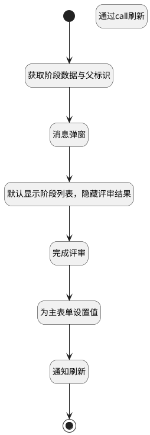

## 完成当前阶段评审 <!-- {docsify-ignore-all} -->

   完成当前阶段评审

### 处理过程




### 处理步骤说明

#### 开始 :id=Begin<sup class="footnote-symbol"> <font color=gray size=1>[开始]</font></sup>


#### 结束 :id=END1<sup class="footnote-symbol"> <font color=gray size=1>[结束]</font></sup>


#### 获取阶段数据与父标识 :id=PREPAREJSPARAM1<sup class="footnote-symbol"> <font color=gray size=1>[准备参数]</font></sup>


1. 将`ctx(上下文).curstage_id` 设置给  `Default(传入变量).curstage_id`
2. 将`view(当前视图).parentView` 设置给  `parent_view(父页面)`
3. 将`parent_view(父页面).layoutPanel.panelItems.form.control` 绑定给  `parent_form(父表单)`

#### 消息弹窗 :id=MSGBOX1<sup class="footnote-symbol"> <font color=gray size=1>[消息弹窗]</font></sup>


#### 默认显示阶段列表，隐藏评审结果 :id=RAWJSCODE4<sup class="footnote-symbol"> <font color=gray size=1>[直接前台代码]</font></sup>


<p class="panel-title"><b>执行代码</b></p>

```javascript
const choose_data = uiLogic.parent_form.details.choosed_content;
choose_data.setDataValue(null);
// uiLogic.parent_form.details.grouppanel6.state.keepAlive=true;
uiLogic.parent_form.details.grouppanel6.state.visible=true;
// uiLogic.parent_form.details.review_results.state.keepAlive=true;
uiLogic.parent_form.details.review_results.state.visible=false;

```

#### 完成评审 :id=DEACTION1<sup class="footnote-symbol"> <font color=gray size=1>[实体行为]</font></sup>


调用实体 [评审内容(REVIEW_CONTENT)](module/TestMgmt/review_content.md) 行为 [完成评审(complete_review)](module/TestMgmt/review_content#行为) ，行为参数为`Default(传入变量)`

#### 为主表单设置值 :id=RAWJSCODE2<sup class="footnote-symbol"> <font color=gray size=1>[直接前台代码]</font></sup>


<p class="panel-title"><b>执行代码</b></p>

```javascript
const need_refresh = uiLogic.parent_form.details.need_refresh;
need_refresh.setDataValue(true);
```

#### 通知刷新 :id=RAWJSCODE3<sup class="footnote-symbol"> <font color=gray size=1>[直接前台代码]</font></sup>


<p class="panel-title"><b>执行代码</b></p>

```javascript
ibiz.mc.command.update.send({ srfdecodename: 'review', srfkey: context.review})
```

#### 通过call刷新 :id=RAWJSCODE1<sup class="footnote-symbol"> <font color=gray size=1>[直接前台代码]</font></sup>


<p class="panel-title"><b>执行代码</b></p>

```javascript
uiLogic.parent_form.details.druipart2.embedView.call('Refresh')
```


### 实体逻辑参数

|    中文名   |    代码名    |  数据类型      |备注 |
| --------| --------| --------  | --------   |
|父页面|parent_view|数据对象||
|传入变量(<i class="fa fa-check"/></i>)|Default|数据对象||
|父表单|parent_form|数据对象||
|表格|grid|部件对象||
|当前视图|view|当前视图对象||
|上下文|ctx|导航视图参数绑定参数||
