## 获取评审内容总条数 <!-- {docsify-ignore-all} -->

   获取评审内容总条数

### 处理过程

```plantuml
@startuml
hide footbox
<style>
root {
  HyperlinkColor #42b983
}
</style>

hide empty description
state "开始" as Begin <<start>> [[$./get_review_content_total#begin {开始}]]
state "设置总条数" as RAWJSCODE1  [[$./get_review_content_total#rawjscode1 {设置总条数}]]
state "结束" as END1 <<end>> [[$./get_review_content_total#end1 {结束}]]


Begin --> RAWJSCODE1
RAWJSCODE1 --> END1


@enduml
```




### 处理步骤说明

#### 开始 :id=Begin<sup class="footnote-symbol"> <font color=gray size=1>[开始]</font></sup>


#### 设置总条数 :id=RAWJSCODE1<sup class="footnote-symbol"> <font color=gray size=1>[直接前台代码]</font></sup>


<p class="panel-title"><b>执行代码</b></p>

```javascript
const total = uiLogic.ctrl.state.total;
const rows = uiLogic.grid.state.rows;
uiLogic.view.layoutPanel.state.data.total = rows.length;

if (rows && rows.length > 0) {
    let total_already = 0;
    rows.forEach(row => {
        const state = row.data.review_result;
    if (state !== null && state !== undefined) {
        total_already++;
    }
    });
    uiLogic.view.layoutPanel.state.data.total_already = total_already;

    const floatTotal = parseFloat(rows.length);
    const floatTotalAlready = parseFloat(total_already);

    console.log("floatTotal:", floatTotal);
    console.log("floatTotalAlready:", floatTotalAlready);
    
    const ratio = Math.round((floatTotalAlready / floatTotal) * 100); 
    console.log(ratio);
    uiLogic.view.layoutPanel.state.data.schedule = ratio;
} else {
    console.log("Error: No rows found");
}

```

#### 结束 :id=END1<sup class="footnote-symbol"> <font color=gray size=1>[结束]</font></sup>


### 实体逻辑参数

|    中文名   |    代码名    |  数据类型      |备注 |
| --------| --------| --------  | --------   |
|表格|grid|部件对象||
|当前部件对象|CTRL|当前部件对象||
|当前视图对象|VIEW|当前视图对象||
|传入变量(<i class="fa fa-check"/></i>)|Default|数据对象||
